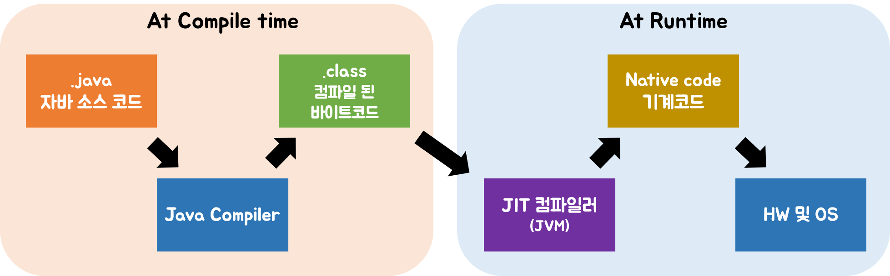
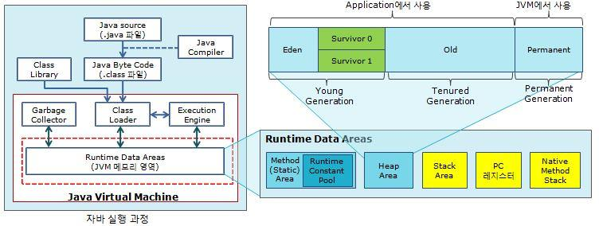
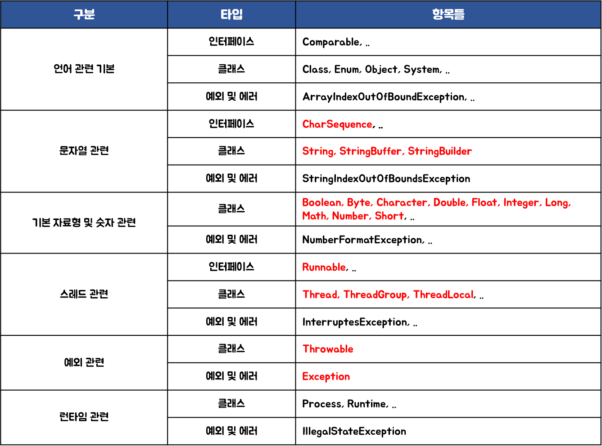

# God Of Java - Book2

### :paperclip: Contents
19. [이쯤에서 자바의 역사와 JVM에 대해서 알아보자](#19장-이쯤에서-자바의-역사와-JVM에-대해서-알아보자)
20. [가장 많이 쓰는 패키지는 자바랭](#20장-가장-많이-쓰는-패키지는-자바랭)
21. [실수를 방지하기 위한 제네릭이라는 것도 있어요](#21장-실수를-방지하기-위한-제네릭이라는-것도-있어요)
22. [자바랭 다음으로 많이 쓰는 애들은 컬렉션 Part1(List)](#22장-자바랭-다음으로-많이-쓰는-애들은-컬렉션-part1list)
23. [자바랭 다음으로 많이 쓰는 애들은 컬렉션 Part2(Set, Queue)](#23장-자바랭-다음으로-많이-쓰는-애들은-컬렉션-part2set-queue)
24. [자바랭 다음으로 많이 쓰는 애들은 컬렉션 Part3(Map)](#24장-자바랭-다음으로-많이-쓰는-애들은-컬렉션-part3map)
25. [쓰레드는 개발자라면 알아두는 것이 좋아요](#25장-쓰레드는-개발자라면-알아두는-것이-좋아요)
26. [파일에 있는 것을 읽고 쓰려면 아이오를 알아야죠](#26장-파일에-있는-것을-읽고-쓰려면-아이오를-알아야죠)
27. [Serializable과 NIO도 살펴 봅시다](#27장-serializable과-nio도-살펴-봅시다)
28. [다른 서버로 데이터를 보내려면 어떻게 하면 되나요?](#28장-다른-서버로-데이터를-보내려면-어떻게-하면-되나요)
29. [이제 주요 API도 알아봤으니 정리해 봅시다](#29장-이제-주요-api도-알아봤으니-정리해-봅시다)
30. [Java 7에서 달라진 것들에는?](#30장-java-7에서-달라진-것들에는)
31. [Java 7에 추가된 것들에는?](#31장-java-7에-추가된-것들에는)
32. [Java 8에 추가된 것들은?](#32장-java-8에-추가된-것들은)
33. [Java 8에서 변경된 것들은?](#33장-java-8에서-변경된-것들은)
34. [GUI 도구인 Java FX](#34장-gui-도구인-java-fx)
35. [JavaFX로 계산기를 만들어보자](#35장-javafx로-계산기를-만들어보자)
36. [이제 저는 뭘 더 공부해야 하는거죠?](#36장-이제-저는-뭘-더-공부해야-하는거죠)

---

## 19장 이쯤에서 자바의 역사와 JVM에 대해서 알아보자

- **JDK**(Java Development Kit): 자바 표준 버전
    - 이름 변화: JDK -> J2SE -> Java SE
    - 플랫폼에 따라 JDK 상이. 하지만 어떤 OS에서 개발하든 JDK 버전만 맞으면 적용할 OS에서 컴파일만 하면 애플리케이션 실행에 문제 없다.
- **JRE**(Java Runtime Environment): 자바의 실행만을 위한 환경.

 

### 자바언어의 특징
1. **단순, 객체지향, 친숙**
    - 자바에 대한 기본 컨셉을 배우는 것은 어렵지 않다.
    - 다형성, 캡슐화 등 객체지향 언어의 특징을 지원할 수 있는 구조
    - 처음부터 모든 것을 만들필요 없이 여러 기능을 API를 통해 제공
2. **견고, 보안상 안전**
    - 컴파일과 실행 시 문법적 오류에 대한 체크를 한다.
    - 메모리 관리 모델이 매우 단순
    - 분산 환경에서 사용하기 위해 디자인되었다.
    - 외부에서 침입이 불가능한 애플리케이션을 만들 수 있도록 한다.(간혹 JDK 내부 오류나 라이브러리의 오류로 인해 보안 취약점이 생기기도 한다.)
3. **아키텍처에 중립적, portable**
    - 다양한 하드웨어 아키텍처에서 수행 가능 (아키텍처 중립적인 바이트 코드 생성)
    - 자바의 버전만 동일하다면, 동일한 프로그램은 어떤 플랫폼에서도 실행 가능
    - 기본 데이터 타입의 크기를 지정 & 숫자 연산자에 대한 행위들을 정의하여 어떤 플랫폼에서도 동일한 결과
    - **JVM**덕분에 이러한 호환성과 포터블한 환경 제공
4. **높은 성능**
    - 자바는 실행 환경에서 최대한의 성능을 낼 수 있도록 되어 있다.
    - 자동화된 가비지 컬렉터는 낮은 우선 순위의 스레드로 동작하기 때문에 보다 높은 성능을 낼 수 있다.
    - 보다 빠른 성능을 위해서 네이티브한 언어로 작성한 부분을 자바에서 사용할 수도 있다. (하지만 자바가 가장 빠른 언어는 아니다.)
5. **인터프리트 언어, 스레드 제공, 동적인 언어**
    - 자바 인터프리터는 자바 바이트 코드를 어떤 장비에서도 수행할 수 있도록 해준다.
    - 자바는 멀티 스레드 환경을 제공하여 동시에 여러 작업 수행이 가능
    - 자바 컴파일러는 컴파일시 엄격한 정적인 점검을 수행. 실행시 동적으로 필요한 프로그램들을 링크. 새로운 코드는 다양한 소스에서의 요청에 의해 연결.

 

### 자바 버전별 차이
*자바 표준 버전 이름은 바뀌어 왔지만, 여기서는 일반적으로 불리는 JDK로 표현한다.*  
*100% 모두 알 필요는 없다.*

- **JDK 1.0**: 최초 버전
- **JDK 1.1**
    - AWT(Abstract Window Toolkit; UI 구성시 사용되는 기반 기술. 많이 사용되지는 않는다.) 이벤트 모델 확장, 변경
    - 내부 클래스 추가
    - JavaBeans, JDBC(Java Database Connectivity), RMI(Remote Method Invocation; 원격 JVM의 메소드 호출하기 위한 기술) 추가
- **JDK 1.2**
    - 1.2부터 1.5버전까지는 J2SE라고 불림
    - strictfp 예약어 추가
    - Swing 코어 라이브에 추가
    - JIT(Just In Time; 메소드의 코드를 네이티브 코드로 변환함으로 JVM에서 번역하지 않게 하여 빠른 성능 제공) 컴파일러 Sun JVM에 추가
    - 자바 플러그인 추가
    - CORBA와 데이터를 주고 받기 위한 IDL 추가
    - Collections 프레임웍 추가
- **JDK 1.3**
    - HotSpot JVM 추가
    - CORBA와의 호환성을 위해 RMI 수정
    - JavaSound 라이브러리 추가
    - JNDI(Java Naming and Directory Interface; 어떤 객체를 쉽게 찾을 수 있게 이름을 지정 후 그 이름으로 객체를 찾음) 코어 라이브러리에 추가
    - 자바의 디버깅을 쉽게 하기 위한 JPDA(Java Platform Debugger Architecture) 추가
    - Synthetic 프록시 클래스 추가
- **JDK 1.4**
    - 자바 커뮤니티 프로세스(JSR) 절차에 따라 개발된 첫번째 릴리즈
    - assert 예약어 추가
    - Perl 언어의 정규 표현식을 따르는 정규 표현식 추가 (어떤 문자열에서 특정 조건이 맞는 값이 있는지 확인할 때 사용. ex) 이메일주소 form 확인)
    - exception chaining을 통해 하위 레벨 예외의 캡슐화 가능
    - IPv6 지원
    - NIO(New Input/Output) non-blocking 추가 (기존의 java.io 패키지의 기능의 단점을 보완하여 빠른 성능 제공)
    - logging API 추가
    - image I/O API 추가
    - 통합 XML 파서와 JAXP 라는 XSLT 프로세서 추가
    - JCE, JSSE, JAAS 같은 통합 보안 및 cryptography extensions 추가
    - Java Web Start 추가
    - 각종 설정 값들을 저장하고 읽는 데 사용하는 Preferences API(java.util.prefs) 추가
- **Java 5**
    - 이전 버전과 Java 5 버전 사용 시스템을 구분 짓는 계기
    - 보다 안전하게 컬렉션 데이터를 처리할 수 있는 **제네릭(Generic)** 추가
    - 어노테이션이라고 불리는 메타데이터 기능 추가
    - autoboxing 및 unboxing 기능 추가 (기본 자료형과 해당 자료형을 객체로 다루는 클래스 간의 자동 데이터 변환. ex) int -> Integer)
    - **enum** 추가
    - 매개 변수의 개수를 가변적으로 선언할 수 있는 varargs 추가. ex) String ... strs
    - for문 사용시 콜론으로 구분하여 배열이나 컬렉션 타입에 저장되어 있는 데이터를 순차적으로 꺼내는 기능 추가
    - static import 추가
    - 스레드 처리를 쉽게 할 수 있는 concurrent 패키지(java.util.concurrent) 추가
    - 스트림이나 버퍼로 들어오는 데이터의 분석(parse)을 보다 편하게 할 수 있는 Scanner 클래스 추가
- **Java 6**
    - 스크립팅 언어가 JVM 위에서 수행 가능
    - 각종 코어 기능 성능 개선
    - Compiler API 추가. 프로그램에서 자바 컴파일러 실행 가능
- **Java 7**
    - [30장 Java 7에서 달라진 것들에는?](#30장-java-7에서-달라진-것들에는)
    - [31장 Java 7에 추가된 것들에는?](#31장-java-7에-추가된-것들에는)
- **Java 8**
    - 람다 표현식 사용이 가능
    - [32장 Java 8에 추가된 것들은?](#32장-java-8에-추가된-것들은)

> 최신 자바 버전별 차이를 확인하려면 영문 위키피디아에서 **"java version history"** 검색

 

### JIT 컴파일러
- Just-In-Time / 동적 변환(dynamic translation)
- 프로그램 실행을 빠르게 하기 위함. 명칭은 컴파일러이지만, 실행시에 적용되는 기술

    
     
    Java JIT compiler (자바 프로그램이 실행되는 절차)

- 인터프리트 방식과 정적 컴파일 방식을 혼합한 것. 컴파일은 인터프리터에 의해 지속적으로 수행되지만, 필요한 코드의 정보는 캐시에 담아두었다가 재사용한다.
    > **인터프리트 컴파일 방식**: 프로그램을 실행할 때마다 컴파일. 간편하지만 성능이 느리다.  
    > **정적 컴파일 방식**: 실행하기 전에 컴파일을 한번만 미리 실행.
- **장점**: 반복적으로 수행되는 코드는 매우 빠른 성능을 보인다.
- **단점**: 처음에 시작할 땐 변환 단계를 거쳐야 하므로 성능이 느리다. (CPU와 JDK의 성능 향상으로 많이 개선됨)

 

### HotSpot JVM
1. **HotSPot 클라이언트 컴파일러**
    - CPU가 하나뿐인 사용자를 위한 컴파일러
    - 시작 시간은 빠르고, 적은 메모리 점유
2. **HotSPot 서버 컴파일러**
    - CPU 코어가 많은 장비에서 어플리케이션을 수행하기 위해 만든 컴파일러
    - 어플리케이션 수행 속도에 초점
- 선택 방법
    - JVM에서 자동 지정 (다음 2가지 조건을 만족하면 **서버 컴파일러**를 선택)
        1. 2개 이상의 물리적 프로세서
        2. 2GB 이상의 물리적 메모리
    - 직접 지정  
        `$ java -server [클래스명]`  
        `$ java -client [클래스명]`  
    - 지정하지 않으면 OS에 따라 어떤 HotSpot 컴파일러를 사용할지 default 설정이 되어 있다. (윈도우는 클라이언트 컴파일러)

### JVM
- Java Virtual Machine(자바 가상 머신)
- java 명령어를 통해 어플리케이션이 수행되면, JVM 위에서 동작
- 작성한 프로그램을 찾고 실행하는 일련의 작업 진행
- 자동으로 메모리 관리를 해준다. -> **GC**

 

### GC (Garbage Collection)
- 동적으로 할당한 메모리 영역(Heap; 모든 Object 타입의 데이터 할당) 중 사용하지 않는 영역을 탐지하여 해제하는 기능
    > *Object를 가리키는 참조 변수는 Stack에 할당*

- **GC 진행 과정**  
    "Concurrent Mark and Sweep"
    1. Garbage Collector가 Stack의 모든 변수를 스캔하면서 각각 어떤 객체를 참조하고 있는지 찾아서 마킹한다. (Mark)
    2. Reachable Object가 참조하고 있는 객체도 찾아서 마킹한다. (Mark)
    3. 마킹되지 않은 객체를 Heap에서 제거한다. (Sweep)

        > **Stop-The-World**: GC를 실행하는 스레드를 제외한 나머지 스레드는 모두 작업을 멈추고, GC작업이 완료된 이후에 중단한 작업을 다시 시작한다.

- **GC는 언제 일어날까?**

    

        
         
        JVM 구조
    

    - 힙의 **Young 영역**에는 젊은 객체, **Old 영역**에는 늙은 객체가 존재한다. (Perm 영역에는 클래스나 메소드 정보)
    - Young 영역은 **Eden 영역**과 **Survival 영역**으로 나뉜다.
        - **Eden**: 객체를 생성하자마자 저장되는 장소

    - **Minor GC / Young GC**
        1. Eden 영역에서 객체가 생성
        2. Eden 영역이 차면 살아있는 객체만 Survival 영역으로 객체가 복사되고(GC), 다시 Eden 영역을 채운다.
        3. Survival 영역이 차면 다른 Survival 영역으로 객체가 복사된다.(GC) 이후에 b 과정의(GC) 결과는 다른 Survival 영역으로 간다. 
            > 두 개의 Survival 영역 중 하나는 반드시 비어있어야 한다.
    - **Major GC / Full GC**
        1. 오래 살아있는 객체(영GC를 수행하며 Survival에 있는 객체의 age를 증가시키다 age가 특정 값 이상이 된 객체)들은 Old 영역으로 이동한다. (Promotion)
        2. Promotion이 진행되면서 Old 영역이 찬다. -> GC

    - Minor와 Major GC 가 반복되며 Garbage Collector가 메모리를 관리한다.

        > *Minor GC가 Major GC 보다 빠르다.*  

- **Garbage Collector 종류**
    - Serial GC: GC를 처리하는 스레드가 1개. 클라이언트용 장비에 최적화된 GC로 WAS에서 사용하면 속도가 매우 느리다.
    - Parallel Young Generation Collector
    - Parallel Old Generation Collector
    - CMS (Concurrent Mark & Sweep Collecor)
    - G1 (Garbage First)

 

> :house: [home](https://github.com/hanwix2/For_Study) :top: [top](#god-of-java---book2)  
http://www.libqa.com/wiki/76

  

## 20장 가장 많이 쓰는 패키지는 자바랭

### java.lang 패키지
    - 자바의 패키지 중 유일하게 import 하지 않아도 내부의 클래스 사용가능
    - 자바의 여러가지 필수 기능 제공 (인터페이스, 클래스, 예외 클래스 등)
        - 언어 관련 기본
        - 문자열 관련
        - 기본 자료형 및 숫자 관련
        - 스레드 관련
        - 예외 관련
        - 런타임 관련
        > 기본적으로 자바로 개발할 때 패키지를 지정할 때에는 같은 역할 및 용도로 묶어서 구분한다.
    - 자바의 기본 어노테이션이 선언되어 있다.
        - Deprecated
        - Override
        - SuppressWarning
    

    
     
    java.lang 분류 (중요 항목은 붉은색으로 표시)

 

> java.lang 패키지에 정의되어 있는 추가적인 에러 중 주요 2가지  
> - OutOfMemoryError: 메모리가 부족하여 발생하는 에러  
> - StackOverFlowError: 호출된 메소드의 깊이가 너무 깊을 때 발생하는 에러

 

### 숫자를 처리하는 클래스들

자바에서 간단한 계산을 할 때에는 보통 기본 자료형을 사용한다. 기본 자료형은 자바이 힙 영역에 저장되지 않고, 스택 영역에 저장되어 관리된다. 따라서 보다 빠른 계산처리가 가능하다.  
하지만 기본 자료형의 숫자를 **객체**로 처리해야할 필요가 있을 수 있다.

- 종류: **Byte, Short, Integer, Long, Float, Double, Character, Boolean**
- 겉보기에는 참조 자료형이지만, 기본 자료형처럼 사용할 수 있다. (자바 컴파일러에서 자동 형변환)
- Character, Boolean을 제외한 숫자를 처리하는 클래스는 Wrapper Class라고 불리며 Number라는 추상클래스를 확장한다.
- 공통된 메소드
    - **parse타입이름()**: 기본 자료형 리턴
    - **valueOf()**: 참조 자료형 리턴
- 숫자를 처리하는 참조 자료형을 만든 이유
    - 매개 변수를 참조 자료형으로만 받는 메소드를 처리하기 위함
    - 제네릭과 같이 기본 자료형을 사용하지 않는 기능을 사용하기 위함
    - MIN_VALUE 또는 MAX_VALUE 와 같이 클래스에 선언된 상수 값을 사용하기 위함
    - 문자열을 숫자로, 숫자를 문자열로 쉽게 변환하고 다양한 진수 변환을 쉽게 처리하기 위함
- 돈 계산과 같은 중요한 연산을 수행할 땐 다음을 사용 (java.math 패키지내 존재 / java.lang.Number 상속 받음)
    - 정수형: BigInteger
    - 소수형: BigDecimal

 

### 각종 정보를 확인하기 위한 System 클래스

- 생성자가 없다. 
- System 클래스에는 3개의 static 변수 존재. 별도의 클래스 객체를 생성할 필요가 없다.

|  선언 및 리턴 타입 | 변수명 |         설명           |
| ----------------- | :---: | :------------------------------- |
|static PrintStream |  err  | 에러 및 오류를 출력할 때 사용한다. |
|static InputStream |  in   | 입력값을 처리할 때 사용한다.       |
|static PrintStream |  out  | 출력값을 처리할 때 사용한다.       |

> PrintStream과 InputStream 은 java.io 패키지에 선언

- System 클래스는 이름 그대로 시스템에 대한 정보를 확인하는 클래스이며, 출력과 관련된 메소드는 없다. (출력은 PrintStream 클래스 객체 이용)
- System 클래스 제공 메소드 분류
    - 시스템 속성값 관리
        > **Properties 클래스**  
        > - java.util 패키지에 속하며 Hashtable의 상속을 받은 클래스.  
        > - 필요 여부와 상관 없이 자바 프로그램을 실행하면 Properties 객체가 생성되며 언제, 어디서든 같은 JVM 내에서 꺼내 사용할 수 있다.
    - 시스템 환경값 조회
        > 환경(environment)값은 대부분 OS나 장비에 관련된 것들이며 변경하지 못하고 읽기만 할 수 있다.
    - GC 수행 *(개인이 수행 금지)*
    - JVM 종료 *(개인이 수행 금지)*
    - 현재 시간 조회
    - 기타 관리용 메소드들

 

- **System.out**
    - 출력을 위한 주요 메소드
        - **print()**: 매개변수의 내용 출력
        - **println()**: 내용 출력 후 줄바꿈 처리
        - **format**
        - **printf**
        - **write**
    
    - null 값을 출력하면 Object의 toString()이 아닌 String의 valueOf()라는 static 메소드를 호출한다. (String.valueOf(null))
        > 객체를 출력할 떄는 toString()보다 valueOf()를 사용하는 것이 안전하다.
    - 출력문의 더하기 문장은 StringBuilder로 변환한다.

 

> :house: [home](https://github.com/hanwix2/For_Study) :top: [top](#god-of-java---book2)  

  

## 21장 실수를 방지하기 위한 제네릭이라는 것도 있어요

### 

> :house: [home](https://github.com/hanwix2/For_Study) :top: [top](#god-of-java---book2)  

  

## 22장 자바랭 다음으로 많이 쓰는 애들은 컬렉션 Part1(List)

> :house: [home](https://github.com/hanwix2/For_Study) :top: [top](#god-of-java---book2)  

  

## 23장 자바랭 다음으로 많이 쓰는 애들은 컬렉션 Part2(Set, Queue)

> :house: [home](https://github.com/hanwix2/For_Study) :top: [top](#god-of-java---book2)  

  

## 24장 자바랭 다음으로 많이 쓰는 애들은 컬렉션 Part3(Map)

> :house: [home](https://github.com/hanwix2/For_Study) :top: [top](#god-of-java---book2)  

  

## 25장 쓰레드는 개발자라면 알아두는 것이 좋아요

> :house: [home](https://github.com/hanwix2/For_Study) :top: [top](#god-of-java---book2)  

  

## 26장 파일에 있는 것을 읽고 쓰려면 아이오를 알아야죠

### I/O 는..
- 파일을 읽거나 저장할 일이 있을 때 사용
- 다른 서버나 디바이스로 보낼 일이 있을 때 사용
- Input과 Output은 JVM 기준
- 초기 자바에서는 IO를 처리하기 위해 java.io 패키지의 클래스 제공. 
    - 바이트 기반의 데이터 처리: InputStream / OutputStream
    - char 기반 문자열로만 되어있는 파일은 Reader / Writer 사용
- **JDK 1.4**부터는 보다 빠른 I/O 처리를 위해 **NIO** 추가: 스트림 기반이 아닌 **Buffer**와 **Channel** 기반
- **Java 7**에서는 기존의 단점을 보완하고 보다 효율적인 처리를 위해 **NIO2** 추가

### File, Files 클래스
- **File**
    - java.io
    - 파일 및 경로 정보를 통제하기 위한 클래스
    - 정체가 불분명하고, 심볼릭 링크 같은 유닉스 계열의 파일에서 사용하는 몇몇 기능을 제대로 제공하지 못한다.

- **Files** 
    - java.nio.file (Java 7의 NIO2)
    - File 클래스의 메소드를 대체하여 제공.
    - 모든 메소드가 static으로 선언되어 별도의 객체 선언 불필요

### InputStream과 OutputStream
- byte 기반의 데이터 I/O 처리
- 자바 I/O는 기본적으로 InputStream(입력)과 OutputStream(출력)이라는 추상 클래스를 통해 제공된다.
- 리소스를 다른 클래스에서도 작업할 수 있게 하던 작업이 종료되면 **close()**로 항상 닫아 주어야 한다.
    > **리소스**: 파일, 네트워크 연결 등 스트림을 통해서 작업할 수 있는 모든 것
- OuputStream의 **flush()**
    - 일반적으로 어떤 리소스에 데이터를 쓸 때, 매번 쓰기 작업을 요청할 때마다 저장하면 효율이 좋지 않다.
    - 저장을 할 때 buffer를 갖고 데이터를 쌓아 두었다가 어느 정도 차면 "현재 버퍼의 내용을 기다리지 말고 무조건 저장"

### Reader와 Writer
- char 기반의 문자열을 처리하기 위한 클래스 (Stream은 byte 기반)
- 작업 종료 후 close() 수행, flush() 등 Stream과 대부분 동일한 메소드
- Writer의 **append()**: 매개 변수로 CharSequence 형(String, StringBuilder, StringBuffer)을 받아 대부분의 문자열 처리 가능
    > write()와 비슷하지만, 만약 만들어진 문자열이 단순 String이 아닌 StringBuilder나 StringBuffer라면 append() 메소드를 사용하는 것이 편하다.
- **BufferedWriter**: write()나 append()를 사용하여 데이터를 쓰면 메소드를 호출했을 때마다 파일에 쓰기 때문에 비효율적. 버퍼에 데이터를 보관하다가 버퍼가 차게되면 데이터를 저장하도록 도와준다.

 

> :house: [home](https://github.com/hanwix2/For_Study) :top: [top](#god-of-java---book2)  

  

## 27장 Serializable과 NIO도 살펴 봅시다

### Serializable

 

> :house: [home](https://github.com/hanwix2/For_Study) :top: [top](#god-of-java---book2)  

  

## 28장 다른 서버로 데이터를 보내려면 어떻게 하면 되나요?

> :house: [home](https://github.com/hanwix2/For_Study) :top: [top](#god-of-java---book2)  

  

## 29장 이제 주요 API도 알아봤으니 정리해 봅시다

> :house: [home](https://github.com/hanwix2/For_Study) :top: [top](#god-of-java---book2)  

  

## 30장 Java 7에서 달라진 것들에는?

> :house: [home](https://github.com/hanwix2/For_Study) :top: [top](#god-of-java---book2)  

  

## 31장 Java 7에 추가된 것들에는?

> :house: [home](https://github.com/hanwix2/For_Study) :top: [top](#god-of-java---book2)  

  

## 32장 Java 8에 추가된 것들은?

> :house: [home](https://github.com/hanwix2/For_Study) :top: [top](#god-of-java---book2)  

  

## 33장 Java 8에서 변경된 것들은?

> :house: [home](https://github.com/hanwix2/For_Study) :top: [top](#god-of-java---book2)  

  

## 34장 GUI 도구인 Java FX

> :house: [home](https://github.com/hanwix2/For_Study) :top: [top](#god-of-java---book2)  

  

## 35장 JavaFX로 계산기를 만들어보자

> :house: [home](https://github.com/hanwix2/For_Study) :top: [top](#god-of-java---book2)  

  

## 36장 이제 저는 뭘 더 공부해야 하는거죠?

> :house: [home](https://github.com/hanwix2/For_Study) :top: [top](#god-of-java---book2)  

  
