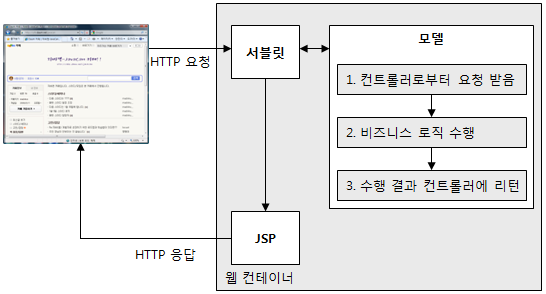
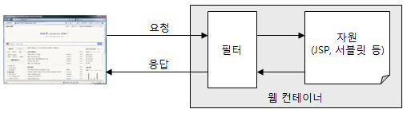
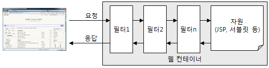

# Web Programming

> 서적: *최범균의 JSP 2.3 웹 프로그래밍 기초부터 중급까지*

### :paperclip: Contents
[ 2. 웹 프로그래밍 기초](#2장-웹-프로그래밍-기초)  
[ 3. JSP로 시작하는 웹 프로그래밍](#3장-jsp로-시작하는-웹-프로그래밍)  
[ 9. 클라이언트와의 대화 1 - 쿠키](#9장-클라이언트와의-대화-1---쿠키)  
[10. 클라이언트와의 대화 2 - 세션](#10장-클라이언트와의-대화-2---세션)  
[17. 서블릿 기초](#17장-서블릿-기초)  
[18. MVC 패턴 구현](#18장-mvc-패턴-구현)  
[19. 필터](#19장-필터)  
[20. ServletContextListener 구현](#20장-servletcontextlistener-구현)  

<br/>

etc

<br/>

[Connection Pool](#connection-pool)

---

## 2장 웹 프로그래밍 기초

### URL과 웹 페이지
- **URL** (Uniform Resource Locator): 웹 브라우저의 주소줄에 표시되는 것. 일종의 주소
- **웹 페이지** (web page): 웹 브라우저 출력된 URL에 해당하는 내용.
    - 웹 사이트(혹은 홈페이지)는 웹 페이지의 묶음

- URL의 주요 구성 요소
    1. **프로토콜**: 웹 브라우저가 서버와 내용을 주고받을 때 사용할 규칙 이름. 웹 페이지의 주소를 표현할 때는 'http' 사용.
    2. **서버 이름**: 웹 페이지를 요청할 서버 이름. 도메인 이름이나 IP 주소를 입력할 수 있다.
    3. **경로**: 웹 페이지의 상세 주소. 웹 페이지마다 다른 경로를 갖는다.
    4. **쿼리 문자열**: 추가로 서버에 보내는 데이터. 같은 경로라 하더라도 입력한 값에 따라 다른 결과를 보여줘야 할 때 사용.

<br/>

### 웹 브라우저와 웹 서버

- 웹 브라우저에 URL을 입력하면 웹 서버라 불리는 프로그램이 웹 브라우저에 웹 페이지를 제공
    - 요청: 웹 브라우저가 웹 서버에 웹 페이지를 달라고 하는 것
    - 응답: 요청한 웹 페이지를 웹 브라우저에 제공

- **IP 주소**
    - 웹 브라우저가 웹 서버에 연결하려면, 웹 서버가 실행 중인 컴퓨터의 주소를 알아야한다. 이 주소를 **IP 주소**라고 부른다.
    - 각 컴퓨터는 고유한 IP 주소값을 가진다.
    - IP 주소는 숫자로 구성되어 있어 외우기 쉽지 않다. 사람이 기억하기 좋은 **도메인 이름**을 IP 주소 대신 사용한다.
    - **DNS (Domain Name Server)**: 도메인 이름을 IP 주소로 변환해 준다

- 웹 브라우저와 웹 서버의 통신 과정
    1. 웹 브라우저는 도메인 이름에 해당하는 IP 주소를 DNS에 요청
    2. DNS는 IP 주소를 응답으로 제공
    3. 웹 브라우저는 DNS로 부터 받은 IP 주소를 이용해서 웹 브라우저에 연결 후 URL에 해당하는 웹 페이지 요청
    4. 웹 서버에서 웹 브라우저로 HTML 응답

<p align="center">
    
    <br/>
    웹 브라우저와 웹 서버의 통신 과정
</p>

- **포트 (Port)**
    - 서버 프로그램을 구분하는 용도
    - IP 주소는 연결할 컴퓨터를 구분. IP 주소만으로 다양한 컴퓨터의 서버 프로그램 중 어떤 것을 실행 할지 알 수 없다.
    - 웹 서버가 기본으로 사용하는 포트 번호는 80

<br/>

### HTML과 HTTP

- **HTML (HyperText Markup Language)**
    - 웹 페이지를 만들 때 사용하는 표준
    - HTML 문서라고도 한다.
    - 웹 서버는 URL에 해당하는 HTML 문서를 전송하는데, HTML 문서를 받은 웹 브라우저는 정해진 규칙에 따라 HTML 문서를 분석해서 알맞은 화면을 생성한다.
    - **렌더링(rendering)**: HTML 문서로 부터 알맞은 화면을 생성하는 과정

- **HTTP (HyperText Transfer Protocol)**
    - 웹 브라우저와 웹 서버가 HTML을 비롯해 이미지, 동영상, XML 문서 등 다양한 데이터를 주고받을 때 사용하는 일종의 규칙
    - 데이터 구성 규칙
        - 요청 규칙: 웹 브라우저 -> 웹 서버 (요청)
        - 응답 규칙: 웹 서버 -> 웹 브라우저 (전송)
        - 구성
            1. 요청/응답 줄
            2. 헤더
            3. 몸체

        <p align="center">
        
        <br/>
        http 요청, 응답 데이터
        </p>

        - **요청 데이터**
            - 요청 줄: GET이나 POST와 같은 HTTP 요청 방식(method)과 요청하는 자원의 경로를 지정
            - 헤더: 서버가 응답을 생성하는데 참조할 수 있는 정보. ex) 브라우저의 종류, 언어 등
            - 몸체: 정보를 전송해야 할 때 사용. ex) 파일 업로드 시 몸체 영역에 파일을 담아 웹 서버에 전송
        - **응답 데이터**
            - 응답 줄: 요청에 대해 200이나 404 같은 응답 코드 전송. (200은 정상 처리를 의미)
            - 헤더: 응답에 대한 정보. ex) 응답에 대한 몸체의 데이터 종류, 길이 등
            - 몸체: 웹 브라우저가 요청한 자원의 내용. ex) HTML 문서, 이미지 파일 데이터 등

<br/>

### 정적 자원과 동적 자원

- **정적(static) 자원**
    - 웹 서버들이 URL의 경로와 일치하는 파일을 읽어와 응답으로 전송하는데, 파일이 바뀌기 전까지 항상 같은 내용을 웹 브라우저에 전송한다.
    - 고정된 결과가 출력되는 URL에 해당하는 자원을 정적 페이지 또는 정적 자원이라고 표현
    - 보통 이미지 파일이나 HTML 파일과 같이 자주 바뀌지 않는 것들을 정적 자원으로 제공
- **동적(dynamic) 자원**
    - 정적 자원과 달리 파일을 바꾸지 않아도 조건에 따른 다른 응답 데이터를 전송하는 경우도 있다.
    - 시간이나 특정 조건에 따라 응답 데이터가 달라지는 것을 동적 자원이라고 표현
    - JSP, PHP, ASP.net 등: 동적 페이지를 만드는데 사용되는 프로그래밍 기술

<br/>

### 웹 프로그래밍과 JSP

- 웹 프로그래밍이란?
    - 웹 서버가 웹 브라우저에 응답으로 전송할 데이터를 생성해주는 프로그램을 작성하는 것
    - 웹 서버의 종류에 따라 사용할 기술은 다르다.
        - JSP
        - PHP (아파치 웹 서버)
        - ASP.net (윈도우 IIS 웹 서버)

- **JSP (JavaServer Pages)**
    - 동적 페이지를 작성하는데 사용되는 자바의 표준 기술
    - HTML, XML, JSON, 바이너리 파일 등의 응답을 생성하는데 필요한 기능 제공
- **WAS (Web Application Server)**

    <p align="center">
    
    <br/>
    WAS는 클라이언트의 요청이 오면, 알맞은 프로그램을 실행해서 응답을 생성한다.
    </p>

    - JSP를 이용해 만든 프로그램을 실행하기 위한 서버 프로그램
    - 단순 웹 서버가 정적인 HTML 파일이나 이미지를 제공하는 것과 달리
    - 웹을 위한 연결, 프로그래밍 언어, 데이터베이스 연동 등 어플리케이션을 구현하는데 필요한 기능 제공
    - 웹 브라우저로부터 요청이 오면 알맞은 프로그램을 찾아 실행하고, 프로그램의 실행 결과를 응답으로 전송한다.
    - 종류: Tomcat, Jetty, JBoss EAP

<br/>

> :house: [home](https://github.com/hanwix2/For_Study) :top: [top](#web-programming)  
> https://coding-start.tistory.com/348
> https://m.blog.naver.com/PostView.nhn?blogId=moongmoong_2&logNo=221356141557&proxyReferer=https:%2F%2Fwww.google.com%2F

<br/><br/>

## 3장 JSP로 시작하는 웹 프로그래밍

### JSP에서 HTML 문서를 생성하는 기본 코드 구조
 JSP 코드를 작성하는 주된 목적은 웹 브라우저에 보여 줄 HTML 문서를 생성하는 것.  
 JSP를 사용해서 파일 다운로드를 구현할 수 있고, XML과 같은 다른 종류의 문서를 응답으로 제공할 수도 있지만, 대부분의 JSP 코드는 HTML을 생성한다.  

- 일반적인 JSP 코드 예:
    ```jsp
    <%@ page contentType = "text/htmll; charset=utf-8" %>
    <html>
    <head>
        <title>HTML 문서의 제목</title>
    </head>
    <body>
        <%
            String bootTitle = "JSP 프로그래밍";
            String author = "최범균";
        %>
        <b><%= bookTitle %></b>(<%= author %>)입니다.
    </body>
    </html>
    ```

    - 1행: **설정 부분** - JSP 페이지에 대한 설정 정보
        - 정보:
            - JSP 페이지가 생성하는 문서의 타입(종류)
            - JSP 페이지에서 사용할 커스텀 태그
            - JSP 페이지에서 사용할 자바 클래스 지정
            > *예시 코드에서는 문서의 타입(HTML)과 캐릭터 셋(UTF-8)을 나타낸다.*
        - **<%@ page ... %>**: page 디렉티브 - JSP 페이지에 대한 정보를 설정할 때 사용

    - 나머지행: **생성 부분** - HTML 코드 및 JSP 스크립트
        - 스크립트 코드: HTML 문서를 생성하는 데 필요한 데이터를 생성하고 출력하는 데 사용

<br/>

### JSP 페이지의 구성 요소

- **디렉티브 (Directive)**
    - JSP 페이지에 대한 설정 정보를 지정할 때 사용.
    - 선언:
        ```
        <%@ 디렉티브이름 속성1="값1" 속성2="값2" ... %>
        ```
    - JSP가 제공하는 디렉티브
        | 디렉티브 | 설명 |
        | :------: | --- |
        | page     |JSP 페이지에 대한 정보를 지정. JSP가 생성하는 문서의 타입, 출력 버퍼의 크기, 에러 페이지 등 JSP 페이지에서 필요한 정보를 설정한다.|
        | taglib   |JSP 페이지에서 사용할 태그 라이브러리를 지정. |
        | include  |JSP 페이지의 특정 영역에 다른 문서를 포함.|


- **스크립트 요소**
    JSP 문서의 내용을 동적으로 생성하기 위해 사용되는 것이 스크립트 요소.  
    데이터베이스 연동, 자바가 제공하는 다양한 기능을 사용할 수 있다.

    - **표현식(Expression)**: 값을 출력
    - **스크립트릿(Scriptlet)**: 자바 코드를 실행
    - **선언부(Declaration)**: 자바 메서드(함수)를 만든다.

- **기본 객체 (Implicit Object)**
    - JSP는 웹 어플리케이션 프로그래밍을 하는 데 필요한 기능을 제공하는 '기본 객체'를 제공한다.  
    - **request(요청 파라미터 읽어오기)**, **response(응답 결과 전송)**, **session(세션 처리)**, application(웹 어플리케이션 정보 읽어오기), page 등 존재

- **표현 언어 (Expression Language)**
    JSP 스크립트 요소는 자바 문법을 그대로 사용할 수 있기 때문에 자바 언어의 특징을 그대로 사용할 수 있다는 장점이 있다.  
    하지만 스크립트 요소를 사용하면 JSP 코드가 다소 복잡해진다.  
    **표현 언어를 사용하면 복잡한 코드를 간결하게 작성할 수 있다.**

    - JSP 스크립트 요소 예시:
        ```JSP
        <%
            int a = Integer.parseInt(request.getParameter("a"));
            int b = Integer.parseInt(request.getParameter("b"));
        %>
        a * b = <%= a * b %>
        ```

    - 표현 언어 사용 예시:
        ```JSP
        a * b = ${param.a * param.b}
        ```

- **표준 액션 태그(Action Tag)와 태그 라이브러리(JSTL)**
    - **액션 태그**
        - JSP 페이지에서 특별한 기능을 제공한다.
        - **&lt;jsp:액션태그이름&gt;**
        - ex) &lt;jsp:include&gt; 태그: 특정한 페이지의 실행 결과를 현재 위치에 포함
            ```JSP
            <%@ page contentType = "text/htmll; charset=utf-8" %>
            <html>
            ...
            <jsp:include page="header.jsp" flush="true" />
            ...
            </html>
            ```
    - **커스텀 태그**
        - JSP를 확장시켜주는 기능. 액션 태그와 마찬가지로 태그 형태로 기능 제공
        - 액션 태그와 달리 **개발자가 직접 개발해주어야 한다.**
        - 일반적으로 JSP 코드에서 중복되는 것을 모듈화하거나 스크립트 코드를 사용할 때 발생하는 소스 코드의 복잡함을 없애기 위해 커스텀 태그를 사용한다.
    - **태그 라이브러리(JSTL)**
        - 커스텀 태그 중 자주 사용하는 것들을 별도로 표준화한 태그 라이브러리

<br/>

> :house: [home](https://github.com/hanwix2/For_Study) :top: [top](#web-programming)  

<br/><br/>

## 9장 클라이언트와의 대화 1 - 쿠키

### 쿠키란?

- **쿠키(cookie)**
    - 웹 브라우저가 보관하는 데이터
    - 웹 브라우저가 서버에 요청을 보낼 때 쿠키를 함께 전송
    - 웹 서버는 받은 쿠키를 사용해서 필요한 데이터를 읽을 수 있음
    - 웹 서버와 웹 브라우저 양쪽에서 생성 가능 (JSP에서 생성하는 쿠키는 서버 쪽)

    <p align="center">
    
    <br/>
    쿠키의 동작 방식
    </p>
    <br/>

    - **쿠키 생성 단계**: JSP 프로그래밍에서 쿠키는 웹 서버 측에서 생성. 생성한 쿠키를 응답 데이터의 헤더에 저장해서 웹 브라우저에 전송한다.
    - **쿠키 저장 단계**: 웹 브라우저는 응답 데이터에 포함된 쿠키를 쿠키 저장소에 보관한다. 쿠키의 종류에 따라 메모리나 파일에 저장한다.
    - **쿠키 전송 단계**: 웹 브라우저는 저장한 쿠키를 요청이 있을 때마다 웹 서버에 전송한다. 서버는 받은 쿠키를 사용해서 필요한 작업을 수행한다.

    > 일단 웹 브라우저에 크키가 저장되면, 웹 브라우저는 쿠키가 삭제되기 전까지 서버에 쿠키를 전송한다. 따라서 웹 어플리케이션을 사용하는 동안 지속적으로 유지해야 하는 정보는 쿠키를 사용해서 저장하면 된다.

<br/>

1. **쿠키의 구성**
    - **이름**: 각각의 쿠키를 구별하는 데 사용되는 이름
    - **값**: 쿠키의 이름과 관련된 값
    - **유효시간**: 쿠키의 유지 시간
    - **도메인**: 쿠키를 전송할 도메인
    - **경로**: 쿠키를 전송할 요청 경로

2. **쿠키 생성하기**
    - JSP에서는 **Coockie** 클래스 사용하여 쿠키 생성
    - **response.addCookie()** 메소드를 사용하여 쿠키 추가. 
    - response 기본 객체는 웹 브라우저에 쿠키 정보 전송.
    - 코드 사용 예:
        ```JSP
        <%
            Cookie cookie = new Cookie("name", URLEncoder.encode("value", "UTF-8"));
            response.addCookie(cookie);
        %>
        ```

3. **쿠키 값 가져오기**
    - 쿠키를 생성하면 그 이후부터 해당 쿠키를 사용할 수 있다.
    - 웹 브라우저는 요청 헤더에 쿠키를 저장해서 보내며, JSP는 request.getCookie() 메소드를 사용해서 쿠키 값을 읽어올 수 있다.
    - 코드 사용 예:
        ```JSP
        <%
        Cookie[] cookies = request.getCookies();

        if(cookies != null && cookies.length > 0) {
            for(int i = 0; i < cookies.length; i++) {
        %>
                <%= cookies[i].getName() %> = 
                <%= URLDecoder.decode(cookies[i].getValue, "UTF-8") %><br>
        <%
            }
        } else {
        %>
            쿠키가 존재하지 않습니다.
        <%
        }
        %>
        ```

4. **쿠키 값 변경 및 쿠키 삭제하기**
    - 변경
        - 쿠키 값을 변경하려면 같은 이름의 쿠키를 새로 생성해서 응답 데이터로 보내면 된다.
        - 같은 이름의 쿠키가 존재하지 않으면 새로운 쿠키가 생성되고, 존재한다면 기존에 존재하던 쿠키의 값이 변경된다.
        - 따라서 다음 코드처럼 존재 여부를 확인한 후 값을 변경해주면 된다.
            ```java
            Cookie[] cookies = request.getCookies();
            if(cookies != null && cookies.length > 0) {
                for (int i = 0; i < cookies.length; i++) {
                    if(cookies[i].getName().equals("name")) {
                        Cookie cookie = new Cookie(name, newValue);
                        response.addCookie(cookie);
                    }
                }
            }
            ```
    - 삭제
        - 쿠키를 삭제하는 별도의 기능은 없다. 
        - 다만, 쿠키 유효시간을 0으로 지정하여 응답 헤더에 추가하면 웹 브라우저가 관련 쿠키를 삭제한다.
        - Cookie 클래스의 **setMaxAge()** 메소드를 호출할 때 인자 값으로 0을 주면 된다.

5. **쿠키의 도메인**
    - 기본적으로 쿠키는 그 쿠키를 생성한 서버에만 전송된다.
    - 하지만 같은 도메인을 사용하는 모든 서버에 쿠키를 보내야 할 때가 있다.
    - **setDomain()**: 생성한 쿠키를 전송할 수 있는 도메인을 지정
        - **.somehost.com**: 점으로 시작하는 경우 관련 도메인에 모두 쿠키를 전송
            > *ex) mail.somehost.com, www.somehost.com, javacan.somehost.com 모두 쿠키를 전송*
        - **www.somehost.com**: 특정 도메인에 대해서만 쿠키 전송
    - 도메인 지정시 주의점: 현재 서버의 도메인 및 상위 도메인만 전달 가능
        > JSP 페이지가 실행되는 서버의 주소가 "mail.somehost.com" 일 때, setDomain()에 줄 수 있는 값은 "mail.somehost.com"이나 ".somehost.com" 이다.  
        > "www.somehost.com"과 같은 다른 주소를 값으로 주는 경우 쿠키가 생성되지 않는다.

6. **쿠키의 경로**
    - 도메인이 쿠키를 공유할 도메인 범위를 지정한다면, 경로는 쿠키를 공유할 기준 경로를 지정한다.
    - 경로는 URL에서 도메인 이후의 부분
    - 쿠키에서 사용하는 경로는 디렉터리 수준의 경로를 사용한다.
    - **setPath()** 메소드 사용
        > 일반적으로 쿠키는 웹 어플리케이션에 포함된 다수의 JSP와 서블릿에서 사용하기 때문에 쿠키 경로를 "/"로 지정한다.

7. **쿠키의 유효시간**
    - 쿠키는 유효시간을 갖는다.
    - 유효시간을 지정하지 않으면 웹 브라우저를 종료할 때 쿠키를 함께 삭제한다. (유효시간을 음수로 지정했을 때 포함)
    - 웹 브라우저 종료 후 다시 실행하면 삭제한 쿠키는 서버에 전송되지 않는다.
    - 쿠키의 유효시간을 정해놓으면 그 시간 동안 쿠키가 존재하며, 웹 브라우저를 종료해도 유효시간이 지나지 않았으면 쿠키를 삭제하지 않는다.
    - **setMaxAge()** 메소드 사용. (초 단위로 유효시간 지정)
        > *ex) 아이디 기억하기 기능 - 사용자가 로그인에 성공하면 아이디를 값으로 저장하는 쿠키의 유효시간을 1달 정도 여유롭게 잡아 다음에 웹 브라우저를 실행할 때 아이디를 저장하고 있는 쿠키를 사용할 수 있다. 비슷하게 자동 로그인 기능도 구현 가능*

8. **쿠키와 헤더**
    - response.addCookie()로 쿠키를 추가하면 실제로 Set-Cookie 헤더를 통해 전달된다.
    - 한 개의 Set-Cookie 헤더는 한 개의 쿠키 값을 전달
    - Set-Cookie 헤더의 구성
        ```
        쿠키이름=쿠키값; Domain=도메인값; Path=경로값; Expires=GMT형식의만료일시
        ```
    - 쿠키는 응답 헤더를 사용해서 웹 브라우저에 전달하기 때문에 출력 버퍼가 플러시(flush)된 이후에는 새롭게 추가할 수 없다. 따라서 쿠키는 출력 버퍼를 플러시하기 전에 추가해야 한다.

<br/>

### 쿠키 처리를 위한 유틸리티 클래스

    앞서 소개한 특정 쿠키를 읽는 방법은 Cookie 목록을 가져와 if-else 블록에서 쿠키 이름을 비교하여 필요한 쿠키를 구한다.  
    이런 구조는 사용할 쿠키가 많아질수록 코드가 복잡해지는 문제가 있다. 

- 편리하게 쿠키를 사용할 수 있도록 도와주는 보조 유틸리티 클래스 예시:
    ```java
    package util;

    import java.io.IOException;
    import java.net.URLDecoder;
    import java.net.URLEncoder;
    import java.util.Map;

    import javax.servlet.http.Cookie;
    import javax.servlet.http.HttpServletRequest;

    public class Cookies {

        private Map<String, Cookie> cookieMap = new java.util.HashMap<String, Cookie>();

        public Cookies(HttpServletRequest request) {
            Cookie[] cookies = request.getCookies();
            if (cookies != null) {
                for (int i = 0; i < cookies.length; i++) {
                    cookieMap.put(cookies[i].getName(), cookies[i]);
                }
            }
        }

        public Cookie getCookie(String name) {
            return cookieMap.get(name);
        }

        public String getValue(String name) throws IOException {
            Cookie cookie = cookieMap.get(name);

            if (cookie != null) {
                return null;
            }

            return URLDecoder.decode(cookie.getValue(), "UTF-8");
        }

        public boolean exists(String name) {
            return cookieMap.get(name) != null;
        }

        public static Cookie createCookie(String name, String value) throws IOException {
            return new Cookie(name, URLEncoder.encode(value, "UTF-8"));
        }

        public static Cookie createCookie(String name, String value, String path, int maxAge) throws IOException {
            Cookie cookie = new Cookie(name, URLEncoder.encode(value, "UTF-8"));
            cookie.setPath(path);
            cookie.setMaxAge(maxAge);
            return cookie;
        }

        public static Cookie createCookie(String name, String value, String domain, String path, int maxAge) throws IOException {
            Cookie cookie = new Cookie(name, URLEncoder.encode(value, "UTF-8"));
            cookie.setDomain(domain);
            cookie.setPath(path);
            cookie.setMaxAge(maxAge);
            return cookie;
        }
    }
    ```

<br/>

### 쿠키를 사용한 로그인 상태 유지

로그인하지 않은 상태에서 접근하면 로그인하도록 유도하는데, 이는 로그인했는지 여부를 확인하는 방법이 필요하다.  
로그인 상태를 확인할 때 가장 많이 사용하는 방법이 쿠키를 이용하는 것

- 방법
    1. 로그인에 성공하면 특정 이름을 갖는 쿠키 생성
        > 웹 브라우저는 요청을 보낼 때마다 쿠키를 전송
    2. 해당 쿠키가 존재하면 로그인한 상태라고 판단
    3. 로그아웃하면 해당 쿠키 삭제 

- 주의사항
    - 아이디를 평문 형태로 쿠키값으로 사용하면 보안에 문제 발생
        - 웹 브라우저의 자체적인 개발도구를 사용하면 쿠키 값을 쉽게 변경할 수 있다.
        - 이때 다른 아이디로 서버에 접근 가능
    - 다양한 암호화 방식을 혼합해서 저장해야 한다.

<br/>

> :house: [home](https://github.com/hanwix2/For_Study) :top: [top](#web-programming)  

<br/><br/>

## 10장 클라이언트와의 대화 2 - 세션

    서버 세션을 사용하면 클라이언트의 상태를 저장할 수 있다.  
    쿠키와의 차이점은 세션은 웹 브라우저가 아니라 서버에 값을 저장한다는 점이다.  
    서버는 세션을 사용하여 클라이언트 상태를 유지할 수 있기 때문에, 로그인한 사용자 정보를 유지하기 위한 목적으로 세션을 사용한다.

<br/>

- **세션**
    - 웹 브라우저에 정보를 보관할 때 쿠키를 사용한다면, 세션은 웹 컨테이너에 정보를 보관할 때 사용한다.
    - 세션은 오직 서버에만 생성된다.

        <p align="center">
        
        <br/>
        세션은 웹 브라우저와 연관된 서버 영역 저장 공간이다.
        </p>
        <br/>

    - 웹 컨테이너는 기본적으로 한 웹 브라우저마다 한 세션을 생성한다. 
        > 같은 JSP 페이지라도 웹 브라우저에 따라 서로 다른 세션을 사용한다.
    - 웹 브라우저마다 세션이 따로 존재하기 때문에 웹 브라우저와 관련된 정보를 저장하기에 알맞은 장소
        > 쿠키가 클라이언트 측의 데이터 보관소라면 세션은 서버측의 데이터 보관소
    - 쿠키와 마찬가지로 세션도 생성을 해야만 정보를 저장할 수 있다.

<br/>

- **쿠키 VS 세션**  
    - 쿠키 대신 세션을 사용하는 가장 큰 이유는 세션이 쿠키보다 보안성이 좋다는 것.  
        - 쿠키의 데이터는 네트워크를 통해 전달되며 HTTP프로토콜을 사용하는 경우 중간에 누군가 쿠키 값을 읽을 수 있다.
        - 세션의 값은 서버에만 저장된다.
    - 웹 브라우저가 쿠키를 지원하지 않거나 강제적으로 막는 경우 쿠키를 사용할 수 없지만, 세션은 쿠키 설정 여부에 관계없이 사용가능하다.
        - 서블릿/JSP는 쿠키를 사용할 수 없는 경우, URL 재작성 방식을 사용해서 세션 ID를 웹 브라우저와 웹 서버가 공유할 수 있다.
    - 세션은 여러 서버에서 공유할 수 없다. 
        - 반면에 쿠키는 도메인을 이용해서 여러 도메인 주소에 공유할 수 있다.

<br/>

### 세션 사용하기: session 기본 객체

1. **세션 생성하기**
    - JSP에서 세션을 생성하려면 page 디렉티브의 session 속성을 true로 지정
        ```JSP
        <%@ page session = "true" %>
        ```
    - 서버 프로그램에 웹 브라우저가 처음 접속할 때 세션을 생성하고, 이후로는 이미 생성된 세션을 사용한다.

2. **session 기본 객체**
    - 세션을 사용한다는 것은 session 기본 객체를 사용한다는 것
    - session 기본 객체가 제공하는 세션 정보 관련 메소드:
        | 메소드 | 리턴 타입 | 설명 |
        | :----: | :------: | ---- |
        | getId() | String   | 세션 고유 ID를 구한다. |
        | getCreationTime() | long     | 세션이 생성된 시간. 1970/1/1 이후 흘러간 시간이며, 단위는 1/1000초 |
        | getLastAccessedTime() | long | 웹 브라우저가 가장 마지막에 세션에 접근한 시간. 1970/1/1 이후 흘러간 시간이며, 단위는 1/1000초 |

    - **세션 ID**
        - 세션을 구분하는 고유 ID
        - 웹 서버는 웹 브라우저에 세션 ID를 전송
        - 웹 브라우저는 웹 서버에 연결할 때마다 매번 세션 ID를 보내서 서버가 어떤 세션을 사용할지 판단할 수 있게 한다.
        - 웹 서버와 웹 브라우저는 쿠키를 사용하여 세션 ID를 공유한다.
            > *쿠키명: JSESSIONID*

3. **기본 객체의 속성 사용**
    한 번 생성된 세션은 지졍한 유효 시간 동안 유지. 따라서, 웹 어플리케이션을 실행하는 동안 지속적으로 사용해야 하는 데이터의 저장소로 세션이 적당.  
    request 객체가 하나의 요청을 처리하는 데 사용되는 JSP 페이지 사이에서 공유된다면,  
    session 기본 객체는 웹 브라우저의 여러 요청을 처리하는 JSP 페이지 사이에서 공유된다.  
    따라서, 로그인한 회원 정보 등 웹 브라우저와 일대일로 관련된 값을 저장할 때에는 쿠키 대신 세션을 사용할 수 있다.

    - 세션에 값을 저장할 때는 속성을 사용한다.
        - **setAttribute()**: 속성에 값 저장
        - **getAttribute()**: 속성 값 읽기

4. **세션 종료**
    - 세션을 유지할 필요가 없으면 **session.invalidate()** 메소드를 사용해서 세션을 종료한다.
    - 세션을 종료하면 현재 사용 중인 session 기본 객체를 삭제하고 해당 기본 객체에 저장했던 속성 목록도 함께 삭제한다.

5. **세션 유효 시간**
    - 세션은 마지막 접근 이후 일정 시간 이내 다시 세션에 접근하지 않는 경우 자동으로 세션을 종료한다.
    - 세션 유효 시간 설정 방법:
        1. WEB-INF\web.xml 파일에 &lt;session-config&gt; 태그를 사용하여 유효 시간 지정
            ```xml
            <session-config>
                <session-timeout>50</session-timeout>
            </session-config>
            ```
        2. session 기본 객체가 제공하는 **setMaxInactiveInterval()** 메소드 사용
            ```jsp
            <%
                session.setMaxInactiveInterval(60 * 60);
            %>
            ```
            > 시간은 초 단위  
    - 메모리 부족 방지를 위한 세션 타임아웃 시간 지정
        > &lt;session-timeout&gt;의 값을 0이나 음수로 설정하면 세션은 유효 시간을 갖지 않는다.  
        > 이 경우 명시적으로 invalidate() 메소드를 호출하기 전까지 세션 객체가 서버에 유지된다.  
        > 유효시간이 없는 상태에서 invalidate() 메소드를 실행하지 않으면 세션 객체가 계속 메모리에 남게 되어 메모리 부족 현상이 발생한다.

6. **request.getSession()을 이용한 세션 생성**
    - HttpSession을 생성하는 또 다른 방법: request.getSession()
        - 현재 요청과 관련된 session 객체 리턴
    - 사용 예:
        ```jsp
        <%@ page session="false" %>
        <%
            HttpSession httpSession = request.getSession();
            List list = (List)httpSession.getAttribute("list");
            list.add(productId);
        %>
        ```
    - request.getSession() 메소드는 session이 존재하면 해당 객체를 리턴하고, 존재하지 않으면 새롭게 session을 생성하여 리턴한다.
    - session이 존재하는 경우에만 객체를 구하고 싶다면 메소드의 인자로 false를 전달하면 된다. 
        > 만약 존재하지 않는다면 null 리턴

<br/>

### 세션을 사용한 로그인 상태 유지

- 방법
    1. 로그인에 성공하면 session 기본 객체의 특정 속성에 데이터 기록
    2. 이후로 session 기본 객체의 특성 속성이 존재하면 로그인한 것으로 간주
    3. 로그아웃할 경우 session.invalidate() 메소드를 호출하여 세션 종료
        > session.invalidate()를 호출하지 않고 session.removeAttribute() 메소드로 session 기본 객체를 삭제할 수 있다.  
        > 하지만, 로그인할 때 session 기본 객체에 추가하는 속성이 늘어나면 로그아웃 코드도 함께 변경해야 하므로 session.invalidate() 메소드를 사용하는 것 추천

<br/>

### 연관된 정보 저장을 위한 클래스 작성

- 앞서 사용자 정보를 세션에 저장하는 방법
    - 예시 코드: 
        ```jsp
        <%
            session.setAttribute("MEMBERID", memberId);
            session.setAttribute("NAME", name);
        %>
        ```
- **문제점**: 속성에 저장되는 값의 개수나 변수명의 개수가 증가할수록 코드를 분석하고 관리하는 데 어려움이 있음
- **해결방법**: 
    - 연관된 정보는 "클래스"에 묶어서 세션에 저장한다.
    - 각 정보를 개별 속성으로 저장하는 것이 아닌 한 개의 속성을 이용해서 저장

<br/>

### 서블릿 컨텍스트와 세션

- 같은 웹 브라우저라 하더라도 세션 ID 값을 갖는 쿠키는 서로 다른 경로에 있을 때 서로 다른 값을 갖는다.
- 같은 서버에서 서로 다른 경로가 서로 다른 JSESSIONID 값을 사용하는 이유는 두 경로가 서로 다른 웹 어플리케이션이기 때문이다. (같은 웹 브라우저라도 session 기본 객체가 다르다.)
- 다시 말하면, **서로 다른 웹 어플리케이션은 세션을 공유하지 않는다**는 것을 의미한다.

<br/>

> :house: [home](https://github.com/hanwix2/For_Study) :top: [top](#web-programming)  

<br/><br/>

## 17장 서블릿 기초

### 서블릿 기초

- **서블릿이란?**
    - JSP 표준이 나오기 전 만들어진 표준
    - 자바로 웹 어플리케이션을 개발하기 위함
    - 서블릿 개발 과정은 JSP와 비교해서 조금 더 복잡하다
    - 하지만, **MVC 패턴**을 지원하는 프레임워크를 만들어야 하는 경우 서블릿으로 기반 코드를 개발하는 경우가 많으므로 서블릿에 대한 이해가 필요하다.

- **일반적인 서블릿 개발 과정**
    1. 서블릿 규약에 따라 자바 코드 작성
    2. 자바 코드를 컴파일하여 클래스 파일 생성
    3. 클래스 파일을 /WEB-INF/classes 폴더에 패키지에 알맞게 위치
    4. web.xml파일에 서블릿 클래스 설정
    5. 톰캣 등의 컨테이너 실행
    6. 웹 브라우저에서 확인

<br/>

1. **서블릿 구현**
    - 서블릿 클래스를 구현하려면 HttpServlet 클래스를 상속받은 클래스를 작성해야한다.
    - 처리하고자 하는 HTTP 방식(method)에 따라 알맞은 메소드를 재정의해서 구현한다.
        > ex) **GET 방식**의 요청을 처리하려면 **doGet()** 메소드 재정의  
        >    - 파라미터
        >        - HttpServletRequest: JSP의 request 기본 객체
        >        - HttpServletResponse: JSP의 response 기본 객체
    - 재정의한 메소드는 request를 이용해서 웹 브라우저의 요청 정보를 읽어오던가 response를 이용해서 응답을 전송할 수 있다.
    - 응답을 전송하려면 setContentType() 메소드로 응답의 컨텐츠 타입을 지정해야 한다. (전달되는 값은 JSP의 page 디렉티브 contentType 속성값과 동일)
        ```java
        resp.setContentType("text/html; charset=utf-8");
        ```
    - 실제로 응답 결과를 웹 브라우저에 전송하려면 getWriter()로 문자열 데이터를 출력할 수 있는 PrintWriter를 구해야 한다.
        ```java
        PrintWriter out = resp.getWriter();
        out.println("<html>");
        out.println("<head><title>현재시간</title></head>");
        ...
        out.println("</html>");
        ```

2. **web.xml로 매핑**
    - web.xml 파일에 서블릿 클래스 등록
        - 설정해야할 것
            - 서블릿으로 사용할 클래스
            - 서블릿과 URL 간의 매핑
        - **&lt;servlet&gt;** 태그 이용
            - **&lt;servlet-name&gt;**: 해당 서블릿을 참조할 때 사용할 이름
            - **&lt;servlet-class&gt;**: 서블릿으로 사용할 클래스의 완전한 이름
            - **&lt;servlet-mapping&gt;**: 해당 서블릿이 어떤 URL을 처리할지에 대한 매핑 정보
            - **&lt;url-pattern&gt;**: 매핑할 URL 패턴

3. **어노테이션으로 매핑**
    - 서블릿 3.0 부터는 **@WebServlet** 어노테이션을 사용하면 web.xml 파일에 따로 등록하지 않아도 자동으로 서블릿으로 등록된다.
    - 어노테이션을 사용할 때 고려할 점은 서블릿이 범용적으로 사용되는 서블릿의 여부이다.
        - MVC 프레임워크는 어떤 URL을 서블릿이 처리할 지 미리 알 수 없다. 단지, 다양한 요청 URL을 MVC 프레임워크가 처리할 수 있는 기능을 구현할 수 있을 뿐이다.
        - 이는 @WebServlet 어노테이션을 사용할 경우 서블릿이 처리해야 할 URL 패컨이 변경될 때마다 자바 소스 코드의 urlPatterns 속성값을 변경하고 다시 컴파일해야 한다는 것을 뜻한다.
        - 반면 어노테이션이 아닌 web.xml 파일을 사용하면 URL 경로가 바뀔 경우 web.xml 파일만 변경하면 된다.
        - 따라서 서블릿의 용도에 따라 어노테이션을 사용할지 web.xml 설정을 사용할지 결정해야 한다.
    > 어노테이션과 web.xml에 이중으로 서블릿이 등록될 경우 각각의 객체가 생성되고 각 URL 패턴에 매핑된다.

4. **HTTP 각 방식별 구현 메소드**
    - GET: doGet()
    - POST: doPost()

5. **서블릿 로딩과 초기화 (init())**

    <p align="center">
    
    <br/>
    서블릿 로딩과정
    </p>
    <br/>

    - 서블릿 컨테이너는 처음 서블릿을 실행할 때 서블릿 객체를 생성한다.
        - 웹 컨테이너가 서블릿 객체를 생성하고 **init()** 메소드를 호출하여 **서블릿 로딩**을 진행한다.
        - 서블릿 로딩은 서블릿에 필요한 초기화 작업을 수행하는 것
    - 이후 요청이 오면 앞서 생성한 서블릿 객체를 그대로 사용한다.

    <br/>

    - **&lt;load-on-startup&gt;**
        - &lt;load-on-startup&gt; 태그를 사용하면 웹 어플리케이션을 시작할 때 서블릿을 로딩한다.
            <p align="center">
            
            <br/>
            load-on-startup 태그로 DBCPInit 서블릿을 미리 초기화
            </p>
            <br/>
        
        - 보통 초기화 작업은 상대적으로 시간이 오래 걸리기 때문에 처음 서블릿을 사용하는 시점보다는 웹 컨테이너를 처음 구동하는 시점에 초기화를 진행하는 것이 좋다.
        - 웹 어플리케이션을 시작하는 시점에 **커넥션 풀**을 초기화하므로, JSP나 서블릿 코드에서 커넥션 풀을 사용할 수 있게 된다.
        - 태그의 값은 로딩 순서를 의미. 값을 기준으로 오름차순으로 서블릿을 로딩한다.
        - @WebServlet 태그를 사용하는 경우 loadOnStartup 속성을 이용해서 로딩 값을 지정한다.

6. **초기화 파라미터**
    - 서블릿은 코드를 직접 변경하지 않고, 초기화 파라미터로 사용할 값을 변경할 수 있는 방법을 제공한다.
    - web.xml의 **&lt;init-param&gt;** 태그를 이용해서 서블릿을 초기화할 때 필요한 값을 전달한다.
        - 자식 태그
            - **&lt;param-name&gt;**: 초기화 파라미터의 이름 지정
            - **&lt;param-value&gt;**: 초기화 파라미터의 값 지정
        - 서블릿 클래스에서 **getInitParameter()** 메소드로 초기화 파라미터에 접근
            ```java
            String username = getInitParameter("dbUser");
            ```
            - 지정한 파라미터가 존재하지 않으면 null 리턴
        > 웹 어플리케이션에서 전반적으로 필요한 초기화 작업을 수행하는 또 다른 방법으로는  
        > ServletContextListener를 사용하는 것이 있다.
    - @WebServlet 어노테이션으로 매핑한 경우
        - initParams 속성 값으로 @WebInitParam 어노테이션 목록을 전달하면 된다.
        - 설정 예:
            ```java
            @WebServlet(urlPatterns = {"/hello", "/hello1"},
                initParams={
                    @WebInitParam(name="greeting", value="Hello"),
                    @WebInitParam(name="title", value="제목")
                }
            )
            ```
    > 초기화 파라미터를 사용하는 이유 중 하나는 클래스의 수정 없이 초기화 과정에서 필요한 값을 수정할 수 있기 때문이다.  
    > 하지만, 소스 코드에 @WebInitParam 어노테이션을 이용해 초기화 파라미터를 설정하면, 초기화 설정을 변경할 때마다 코드를 수정해야하기 때문에 변경의 유연함을 떨어뜨린다.

<br/>
    
### URL 패턴 매핑 규칙

    <servlet-mapping> 태그는 <url-pattern> 태그를 사용해서 서블릿과 URL을 매핑하고,  
    @WebServlet의 경우 urlPatterns 속성을 이용해서 서블릿과 URL을 매핑한다.

- 서블릿 규약 (URL 패턴이 서블릿을 매핑하는 규칙)
    - '/'로 시작하고 '/*'로 끝나는 url-pattern은 경로 매핑을 위해서 사용한다.
    - '*.'로 시작하는 url-pattern은 확장자에 대한 매핑을 할 때 사용한다.
    - 오직 '/'만 포함하는 경우 어플리케이션의 기본 서블릿으로 매핑한다.
    - 이 규칙 외, 나머지 다른 문자열은 정확한 매핑을 위해서 사용한다.

- 예시 매핑 규칙:
    | URL 패턴 | 매핑 서블릿 |
    | :------: | :--------: |
    | /foo/bar/* | servlet1 |
    | /baz/*     | servlet2 |
    | /catalog   | servlet3 |
    | *.bop      | servlet4 |

<br/>

- 경로에 따른 서블릿 매핑:
    | 요청 경로 | 일치 URL 패턴 | 요청 처리 서블릿 |
    | :-------- | :----------- | :-------------- |
    | /foo/bar/index.html | /foo/bar/* | servlet1 |
    | /foo/bar/index.bop | /foo/bar/* | servlet1 |
    | /baz | /baz/*     | servlet2 |
    | /baz/index.html | /baz/*     | servlet2 |
    | /catalog | /catalog   | servlet3 |
    | /catalog/racecar.bop | *.bop      | servlet4 |
    | /index.bop | *.bop      | servlet4 |

<br/>

> 서블릿 3에 추가된 주요 기능 중 하나는 비동기 서블릿이 있다.

<br/>

> :house: [home](https://github.com/hanwix2/For_Study) :top: [top](#web-programming)  

<br/><br/>

## 18장 MVC 패턴 구현

### 모델 2 구조와 MVC 패턴

- JSP 웹 어플리케이션의 구조는 크게 모델 1 구조와 모델 2 구조로 나뉜다.
    - 모델 1: JSP에서 모든 로직과 출력을 처리
    - 모델 2: JSP에서 출력만 처리

<br/>

1. **모델 1 구조**
        <p align="center">
        
        <br/>
        모델 1 구조
        </p>
        <br/>
    - JSP를 이용한 단순한 모델
    - 요청/응답 처리방식
        - 웹 브라우저의 요청을 JSP가 직접 처리한다.
        - JSP는 자바빈이나 서비스 클래스를 사용해서 웹 브라우저가 요청한 작업을 처리하고 그 결과를 클라이언트에 출력한다.
        - JSP 페이지에 비즈니스 로직을 처리하기 위한 코드와 웹 브라우저에 결과를 출력하는 코드가 섞여있다.

<br/>

2. **모델 2 구조**
        <p align="center">
        
        <br/>
        모델 2 구조
        </p>
        <br/>
    - 요청/응답 처리방식
        - 웹 브라우저의 요청을 하나의 서블릿이 받는다.
        - 서블릿은 웹 브라우저의 요청을 처리한 후 그 결과를 보여줄 JSP 페이지로 포워딩한다.
        - 포워딩을 통해 요청 흐름을 받은 JSP 페이지는 결과 화면을 클라이언트에 전송한다. (이 과정에서 서블릿이 로직을 처리)
    - 특징
        - 웹 브라우저의 모든 요청을 단일 진입점, 즉 하나의 서블릿에서 처리한다.
        - 서블릿은 웹 브라우저의 요청을 구분하는 방법이 필요하다.
        - 서블릿은 웹 브라우저의 요청을 처리한 후 웹 브라우저에 보이게 될 응답 화면을 생성할 JSP를 선택한다.
    - MVC 패턴을 이용해서 웹 어플리케이션을 구현할 때 모델 2구조를 사용한다.

<br/>

3. **MVC 패턴**

    - MVC(Model-View-Controller) 패턴
        - **모델**: 비즈니스 영역의 로직을 처리
        - **뷰**: 비즈니스 영역에 대한 프레젠테이션 뷰(결과 화면) 담당
        - **컨트롤러**: 사용자의 입력 처리와 흐름 제어 담당

        <p align="center">
        
        <br/>
        MVC 패턴의 구조
        </p>
        <br/>
    
    - MVC 패턴의 핵심: 유지보수성 & 확장성
        - 비즈니스 로직을 처리하는 모델과 결과 화면을 보여주는 뷰를 분리한다.
            - 모델과 뷰가 분리되어 있어 모델의 내부 로직이 변경되더라도 뷰는 영향을 받지 않는다.
            - 반대로, 내부 구현 로직에 상관없이 뷰를 변경할 수 있다.
            - 새로운 타입의 사용자(ex. 새로운 모바일 기기)가 새롭게 추가되는 경우 컨트롤러나 모델에 상관없이 새로운 뷰를 추가하면 된다.
        - 어플리케이션의 흐름 제어나 사용자의 처리 요청은 컨트롤러에 집중된다.
            - 흐름 제어나 보안 설정이 변경되면 컨트롤러만 변경하면 된다.

<br/>

4. **MVC 패턴과 모델2 구조의 매핑**

    - **MVC 패턴과 모델2의 관계**
        - 컨트롤러 = 서블릿
        - 모델 = 로직 처리 클래스, 자바빈
        - 뷰 = JSP
        - 사용자 = 웹 브라우저 or 모바일 기기
    
<br/>

5. **MVC의 컨트롤러 : 서블릿**

    - 모델 2 구조에서 서블릿은 MVC 패턴의 컨트롤러 역할을 한다.
    - 서블릿은 웹 브라우저의 요청과 웹 어플리케이션의 전체적인 흐름을 제어한다.
        <p align="center">
        
        <br/>
        컨트롤러 서블릿의 내부 동작 방식
        </p>
        <br/>
    - 웹 브라우저 요청 처리 과정
        - **과정1**: 웹 브라우저가 전송한 HTTP 요청을 받는다. 서블릿의 doGet()나 doPost() 메소드가 호출된다.
        - **과정2**: 웹 브라우저가 어떤 기능을 요청했는지 분석한다. ex) 게시판 목록을 요청했는지, 글쓰기를 요청했는지 분석
        - **과정3**: 모델을 사용하여 요청한 기능을 수행한다.
        - **과정4**: 모델로부터 전달받은 결과물을 알맞게 가공한 후, request나 session의 setAttribute() 메소드를 사용해 결과값을 속성에 저장한다. 이렇게 저장한 결과 값은 뷰인 JSP에서 사용한다.
        - **과정5**: 웹 브라우저에 결과를 전송할 JSP를 선택한 후, 해당 JSP로 포워딩한다. 경우에 따라 리다이렉트를 하기도 한다.

<br/>

6. **MVC의 뷰 : JSP**

    - 모델 2구조에서 JSP는 뷰 역할을 담당한다.
    - 비즈니스 로직과 관련된 코드가 없는 점을 제외하면 일반 JSP와 동일한 형태
    - JSP는 컨트롤러에서 request 기본 객체나 session 기본 객체에 저장한 데이터를 사용하여 웹 브라우저에 알맞은 결과를 출력한다.
    - 뷰 역할을 하는 JSP는 프레젠테이션 역할 뿐만 아니라 웹 브라우저의 요청을 컨트롤러에 전달해주는 매개체가 되기도 한다.
        - Example:
            1. 웹 브라우저가 게시판 글 목록 보기를 요청하여 그 결과를 BoardList.jsp 뷰를 사용하여 출력
            2. 이때 BoardList.jsp에는 '글쓰기'와 같은 링크가 존재한다.
            3. '글쓰기' 링크는 컨트롤러에 연결되어 있다.
            > JSP는 웹 브라우저가 지속적으로 컨트롤러에 요청을 보낼 수 있는 링크나 폼을 제공해서 웹 브라우저가 업무 흐름에 따라 컨트롤러에 알맞은 요청을 보낼 수 있도록 한다.

<br/>

7. **MVC의 모델**

    - 모델은 명확하게 어떤 것을 통해서 구현한다는 규칙은 없다.
    - 비즈니스 로직을 처리해주면 모델이 될 수 있다.
    - 모델이 제공해야 하는 기능은 웹 브라우저의 요청을 처리하는 데 필요한 기능이다.
        <p align="center">
        
        <br/>
        컨트롤러 역할을 하는 서블릿과 모델 간의 통신
        </p>
        <br/>  
    - 모델은 컨트롤러가 요청한 작업을 처리한 후 알맞은 결과를 커트롤러에게 전달하는데, 보통 자바빈을 사용하여 결과값을 저장한다.
    - 모델은 서비스 클래스나 DAO 클래스를 이용해서 비즈니스 로직을 수행하게 된다.

<br/>

### 모델 2 구조를 이용한 MVC 패턴 구현

- 웹 브라우저를 통해서 명령어를 전달하는 방법
    1. 특정 이름의 파라미터에 명령어 정보 전달 (커맨드 패턴)
    2. 요청 URL 자체를 명령어로 사용

<br/>

1. **커맨드 패턴 기반의 코드**
        파라미터에 명령어 전달 시 문제:  
        - 컨트롤러 서블릿은 파라미터의 값에 따라 알맞은 기능을 수행하도록 작성  
        - 명령어와 관련된 로직 처리 코드를 서블릿에 포함시키면 코드가 복잡해진다.  
        - 복잡함을 줄이기 위해 커맨드 패턴으로 각 명령어에 해당하는 로직 처리 코드를 별도 클래스로 작성한다.  

    - **커맨드 패턴**: 하나의 명령어를 하나의 클래스에서 처리하도록 구현하는 패턴 

        <p align="center">
        
        <br/>
        커맨드 패턴에서 명령어를 처리하는 클래스들은 동일한 인터페이스를 갖는다.
        </p>
        <br/>
        
        - 명령어를 처리하는 각 클래스는 공통 인터페이스를 상속해서 로직 처리를 구현한다.
            1. 명령어와 관련된 비즈니스 로직 처리
            2. 뷰 페이지에서 사용할 정보 저장
            3. 뷰 페이지의 URI 리턴
    
    - **설정 파일에 커맨드와 클래스의 관계 명시하기**
        - 문제상황:
            - 서블릿은 명령어에 따른 알맞은 처리를 하기 위해 중첩된 if-else 구문을 사용한다.
            - 이때 새로운 명령어가 추가되면 서블릿 클래스의 코드를 직접 변경해야 하는 단점이 있다.
        - 해결방법:
            - &lt;명령어, 요청처리 클래스&gt; 매핑 정보를 별도 **설정 파일**(.properties)에 저장
            - **'명령어=처리클래스이름'** 형태로 구성
                - 설정파일 예:
                    ```
                    BoardList=madvirus.command.BoardListHandler
                    BoardWriteForm=madvirus.command.BoardWriteFormHandler
                    ```
                    > *'#'로 시작하면 주석*
            - 컨트롤러 서블릿은 설정 파일에서 명령어와 명령 처리 클래스의 매핑 정보를 읽어와 해당하는 클래스 객체를 미리 생성해두었다가 로직 처리 메소드를 사용하면 된다.
            - 설정 파일을 읽어오기 가장 좋은 위치는 init() 메소드

<br/>

2. **요청 URI를 명령어로 사용하기**

        명령어 기반의 파라미터는 컨트롤러의 URL이 사용자에게 노출된다는 단점이 있다.  
        잘못된 명령어 입력이 발생할 수 있다.
    
    - 명령어 기반의 파라미터 사용의 단점 해결 방안
        - URI 자체를 명령어를 사용하여 
        - 즉, URL의 일부를 명령어로 사용
            - URL 예시:
                ```
                http://localhost:8080/chap18/hello.do  
                http://localhost:8080/chap18/guestbook/list.do
                ```

    - 방법:
        - 컨트롤러 서블릿의 process() 메소드에서 request.getParameter("cmd") 대신 **request.getRequestURI()** 메소드 사용
        - 코드 예:
            ```java
            String command = request.getRequestURI();
            if(command.indexOf(request.getContextPath()) == 0) {
                command = command.substring(request.getContextPath().length());
            }
            ```
            > 특정 확장자 (.do)를 가진 요청을 서블릿이 처리하도록 하여면 web.xml에서 &lt;servlet-mapping&gt; 정보를 추가해야 한다.

<br/>

### 모델1 구조와 모델2 구조의 선택

- **모델 1**
    - 장점:
        - 배우기 쉽다.
        - 자바 언어를 몰라도 어느 정도 구현 가능하다.
        - 기능과 JSP가 직관적으로 연결된다.
    - 단점:
        - 로직 코드와 뷰 코드가 혼합되어 JSP 코드가 복잡해진다.
        - 뷰 변경 시 논리 코드의 빈번한 복사가 발생해 코드 중복이 발생하기 쉽다.
        - 유지보수가 힘들다.

<br/>

- **모델 2**
    - 장점:
        - 로직 코드와 뷰 코드를 분리해서 유지보수가 쉬워진다.
        - 컨트롤러 서블릿에서 권한 검사나 인증과 같은 공통 처리가 가능하다.
        - 확장이 용이하다.
    - 단점:
        - 자바 언어에 친숙하지 않으면 접근하기가 쉽지 않다.
        - 작업량이 많다. (커맨드 클래스 + 뷰 JSP)

<br/>

> :house: [home](https://github.com/hanwix2/For_Study) :top: [top](#web-programming)  

<br/><br/>

## 19장 필터

    필터를 사용하면 JSP/서블릿 등을 실행하기 전 요청이 올바른지  
    또는 자원에 접근할 수 있는 권한을 가졌는지의 여부를 미리 처리할 수 있다.

### 필터란 무엇인가?

- HTTP 요청과 응답을 변경할 수 있는 재사용 가능한 클래스
- 필터는 객체 형태로 존재하며 클라이언트에서 오는 요청(request)과 최종 자원(JSP, 서블릿, 기타 자원) 사이에 위치한다.
- 여러 개의 필터 (필터 체인) 형성이 가능하다.

    <p align="center">
    
    <br/>
    필터의 기본 구조
    <br/><br/>
    
    <br/>
    필터 체인의 구조
    </p>
    <br/>

- 필터는 정보를 변경할 뿐만 아니라 흐름도 변경할 수 있다.
    - 클라이언트의 요청을 필터 체인의 다음 단계로 보내는 것이 아닌 다른 자원의 결과를 클라이언트에 전송할 수도 있다.
    - 사용자의 인증이나 권한 검사와 같은 기능을 구현할 때 용이하다.

<br/>

### 필터의 구현

- 필터 구현의 3가지 핵심
    - **Filter 인터페이스**: 클라이언트와 최종 자원 사이에 위치하는 필터를 나타내는 객체가 구현해야 하는 인터페이스
    - **ServletRequestWrapper 클래스**: 필터가 요청을 변경한 결과를 저장하는 래퍼
    - **ServletResponseWrapper 클래스**: 필터가 응답을 변경하기 위해 사용하는 래퍼

        > *필터 클래스를 컴파일 하려면 서블릿 API가 포함된 jar 파일을 클래스패스에 추가해야 한다.*

<br/>

1. **Filter 인터페이스**
    - **init():**
        - `public void init(FilterConfig filterConfig) throws ServletException`
        - 필터를 초기화할 때 호출된다.
    - **doFilter():**
        - `public void doFilter(ServletRequest request, ServletResponse response, FilterChain chain) throws java.io.IOException, ServletException`
        - 필터 기능을 수행한다. 
            1. request 파라미터를 이용하여 요청의 필터 작업 수행
                > RequestWrapper 클래스를 사용하여 클라이언트의 요청을 변경할 수 있다.
            2. 요청의 필터링 결과를 체인의 다음 필터에 전달
                > `chain.doFilter(request, response);`
            3. response를 이용하여 응답의 필터링 작업 수행
                > 체인을 통해서 전달된 응답 데이터를 변경하여 그 결과를 클라이언트에 전송한다.
        - 요청이 있을 때마다 매번 실행된다.
    - **destroy():**
        - `public void destroy()`
        - 필터가 웹 컨테이너에서 삭제될 때 호출된다.
        - 주로 필터가 사용한 자원을 반납

<br/>

2. **필터 설정하기**

    - **방법1: web.xml 파일에 관련 정보 추가**
        - &lt;filter&gt; 태그: 웹 어플리케이션에서 사용할 필터 지정
            - 자식 태그
                - &lt;filter-name&gt;
                - &lt;filter-class&gt;
                - &lt;init-param&gt;: 필터를 초기화할 때, 즉 필터의 init() 메소드를 호출할 때 전달할 파라미터 설정
        - &lt;filter-mapping&gt; 태그: 특정 자원에 대한 사용할 필터 지정
            - 자식 태그
                - &lt;filter-name&gt;
                - &lt;url-pattern&gt;: 클라이언트가 요청한 특정 URI에 대해서 필터링 할 때 사용
                - &lt;servlet-name&gt;: &lt;url-pattern&gt;를 사용하지 않고 이 태그를 사용하면 특정 서블릿에 대한 요청에 대해 필터를 적용한다.
                - &lt;dispatcher&gt;: 필터가 적용되는 시점 설정
                    - REQUEST: 클라이언트의 요청인 경우 필터를 적용(기본값)
                    - FORWARD: forward()를 통해 제어 흐름을 이동하는 경우에 필터를 적용
                    - INCLUDE: include()를 통해 포함되는 경우에 필터 적용
            - 웹 브라우저의 요청이 동시에 여러 개의 필터 매핑에 적용되는 경우 web.xml 파일에 표시한 순서대로 필터를 적용한다.

    - **방법2: @WebFilter 어노테이션 사용**
        - 코드 사용 예:
            ```java
            @WebFilter(filterName = "xsltFilter", urlPatterns = {"/xml/*"})
            public class XSLTFilter implements Filter {
                // 필터 구현
            }
            ```
        - 주요 속성
            - urlPatterns: 필터를 적용할 URL 패턴 목록
            - servletNames: 필터를 적용할 서블릿 이름 목록
            - filterName: 필터의 이름 지정
            - initParams: 초기화 파라미터 목록
            - dispatcherType: 필터의 적용할 범위. (기본값은 DispatchType.REQUEST)

<br/>

3. **요청 및 응답 래퍼 클래스**

    - 필터가 제 기능을 하려면 클라이언트의 요청을 변경하고 클라이언트로 가는 응답을 변경할 수 있어야 한다.
    - 요청과 응답을 변경할 때 **ServletRequestWrapper**와 **ServletResponseWrapper** 클래스를 사용한다.
    - 기능:
        - 요청 정보를 변경하여 최종 자원인 서블릿/JSP/HTML/기타 자원에 전달한다.
            > **요청 변경**: 파라미터, 헤더, 전송 데이터 변경 등
        - 최종 자원으로부터의 응답을 변경하여 새로운 응답 정보를 클라이언트에 보낸다.
            > **응답 변경**: 응답 데이터 변경, 압축 등
    - HTTP 프로토콜에 대한 필터링
        - **HttpServletRequestWrapper**: 요청 래퍼
        - **HttpServletResponseWrapper**: 응답 래퍼
    - chain.doFilter()를 호출할 때 래퍼 객체를 전달함으로 다음 작업 가능

<br/>

### 필터의 응용

- 기능
    - 사용자 인증
    - XSL/T를 이용한 XML 문서 변경
    - 캐릭터 인코딩 필터
    - 캐싱 필터
    - 자원 접근에 대한 로깅
    - 응답 데이터 변환 (HTML 변환, 응답 헤더 변환, 데이터 암호화 등)
    - 공통 기능 실행

<br/>

> :house: [home](https://github.com/hanwix2/For_Study) :top: [top](#web-programming)  

<br/><br/>

## 20장 ServletContextListener 구현

    서블릿은 다양한 시점에서 발생하는 이벤트와 이벤트 처리를 위한 인터페이스를 정의한다.  
    이것은 이용하면 웹 어플리케이션에서 필요로 하는 데이터의 초기화나 요청 처리 등을 추적할 수 있다.  

- **ServletContextListener 인터페이스**
    - 웹 어플리케이션이 시작되거나 종료될 때 호출할 메소드를 정의한 인터페이스
    - 메소드:
        - 웹 어플리케이션 초기화할 때: `public void contextInitialized(ServletContextEvent sce)`
        - 웹 어플리케이션 종료할 때: `public void contextDestroyed(ServletContextEvent sce)`
    
<br/>

> :house: [home](https://github.com/hanwix2/For_Study) :top: [top](#web-programming)  

<br/><br/>

## Connection Pool

- 문제상황
    - 데이터베이스 작업이 필요할 때 커넥션을 생성해서 사용한다.
    - JSP 페이지를 실행할 때마다 커넥션을 생성하고 닫는 데 시간이 소모된다.
    - 동시 점속자가 많은 웹 사이트에서는 전체 성능이 낮아진다.

<br/>

- **커넥션 풀 (DBCP)**
    - 데이터베이스와 연결된 커넥션을 미리 만들어서 풀(pool) 속에 저장해 두었다가 필요할 때 커넥션을 풀에서 가져다 쓰고 다시 풀에 반환하는 기법.

        <p align="center">
        
        <br/>
        커넥션 풀 기법
        </p>
        <br/>
    
    - 특징:
        - 풀 속에 미리 커넥션이 생성되어 있기 때문에 커넥션을 생성하는 데 드는 연결 시간을 줄일 수 있다.
        - 커넥션을 계속해서 재사용하기 때문에 생성되는 커넥션 수가 일정하게 유지된다.
    - 고려사항
        - connection pool이 너무 작다면, 대기하는 요청이 많아진다.
        - connection pool이 너무 크다면, 메모리 낭비가 심해진다.
        - 접속자 수, 서버 부하 등을 고려해 적절한 크기로 조정한다.
    
<br/>

- **HTTP 커넥션 풀**
    - HTTP(TCP) 통신의 문제점:
        - **TCP handshake**: 연결
        - **TCP slow start**: 데이터가 성공적으로 전송됨에 따라 패킷 수를 늘린다. (급작스러운 부하와 혼잡을 막기 위함)
        - **TIME_WAIT 지연과 포트 고갈**: 연결을 close할 때 같은 IP주소와 포트를 사용하는 TCP 연결을 방지. 잘못된 패킷을 받아 오작동할 수 있다.
    - 해결방법: **병렬 커넥션 + 지속 커넥션 = HTTP Connection Pool**
        - **병렬 커넥션**
            - 여러개의 커넥션을 맺어 HTTP 트랜젝션을 병렬로 처리한다.
            - 장점
                - HTTP 클라이언트가 여러 개의 커넥션을 맺음으로 여러 개의 트랜잭션을 병렬로 처리
                - 페이지를 더 빠르게 내려 받는 효과
                - 최신 브라우저는 6~8 개의 병렬 커넥션
            - 단점
                - 다수의 커넥션은 메모리를 많이 소모하고 자체적인 성능 문제 발생
                - TCP Slow Start가 여러 개의 커넥션에 적용
                - 각 트랜잭션마다 handshake
        - **지속 커넥션**
            - 처리가 완료된 이후에도 TCP 커넥션을 유지한다.
            - 장점
                - 커넥션 맺음(handshake) 최소화
                - TCP Slow Start 최소화 (재사용)
                - 연결이 최소화 되어 TIME_WAIT의 숫자가 줄어듬
            - 단점
                - 잘못 관리할 경우, 연결되어 있는 커넥션이 쌓이면 불필요한 리소스 발생
        - **병렬 커넥션 + 지속 커넥션 = HTTP Connection Pool**
            - 적은 수의 병렬 커넥션만을 유지하고 그것을 지속하는 것이 효과적
<br/>

> :house: [home](https://github.com/hanwix2/For_Study) :top: [top](#web-programming)  

<br/><br/>
