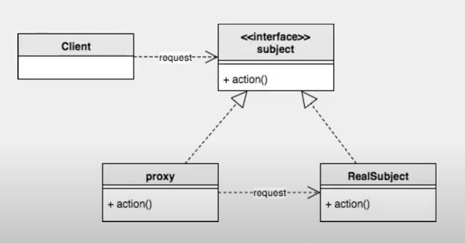

# 스프링 입문을 위한 자바 객체 지향의 원리와 이해

### :paperclip: Contents
- [1. 사람을 사랑한 기술](#1장-사람을-사랑한-기술)
- [2. 자바와 절차적/구조적 프로그래밍](#2장-자바와-절차적구조적-프로그래밍)
- [3. 자바와 객체 지향](#3장-자바와-객체-지향)
- [4. 자바가 확장한 객체 지향](#4장-자바가-확장한-객체-지향)
- [5. 객체 지향 설계 5원칙 - SOLID](#5장-객체-지향-설계-5원칙---solid)
- [6. 스프링이 사랑한 디자인 패턴](#6장-스프링이-사랑한-디자인-패턴)
- [7. 스프링 삼각형과 설정 정보](#7장-스프링-삼각형과-설정-정보)

---

## 1장 사람을 사랑한 기술

### 기계어에서 객체 지향 프로그래밍 언어로

- **기계어 - 0과 1의 행진 / 너무나 비인간적인 언어**
    - 컴퓨터는 2진법밖에 모르지만 대단히 빠르고 정확하다.
    - 기계어
        - 기계가 이해하는 유일한 언어로, 2진 숫자인 0과 1로만 표현
        - 기계어 코드는 CPU에 따라 다르다. (애드삭 or 유니박)

- **어셈블리어 - 0과 1의 행진을 벗어나 인간 지향으로 / 기계어 니모닉**
    - 어셈블리어
        - **어셈블리**: 기계어 명령어를 일상 용어(니모닉; 어떤 것을 기억하는 데 도움을 주는 것)로 표현하는 매칭 코드표
        - CPU마다 기계어가 다르기 때문에 각각 어셈블리어도 다르다.
        - **어셈블러**: 어셈블리어를 기계어로 번역하는 소프트웨어는 어셈블러
    
- **C언어 - 강력한 이식성 / One Source Multi Object Use Anywhere**
    - 특징:
        - **One source (싱글 소스)**
            - 하나의 C 소스 파일만 작성
            - 기존의 어셈블리어로 개발할 때 프로그램의 소스 파일을 각 기계의 종류만큼 만들어야 했다. (멀티 소스)
            - 하나의 소스 파일을 각 기계에 맞는 컴파일러로 컴파일하면 각 기계에 맞는 기계어 목적 파일이 만들어진다.
        - **Multi Object**
            - 기종마다 하나씩 기계어 목적 파일을 생성
        - **Use Anywhere**
            - 모든 컴퓨터에서 실행 가능
    - 정리:
        - 한계: 운영체제별 특성이 달라 하나의 소스로 컴파일하기 전 그 기종에 맞게 소스를 변경하는 작업 필요
        - 엄밀히 말하면 one source 뒤에 fix source(소스 수정 작업)가 필요하다.
        - 하지만 이식성이 좋아진 것은 진실 (어셈블리어 대비)
        - 인간의 언어 체계가 기계어와 1:1 매칭이 아닌 m:n 매칭이 가능해졌다.

- **C++ - 정말 인간적인 프로그래밍 방법론, 객체 지향**
    - 객체 지향 도입

- **자바 - 진정한 객체 지향 언어**
    - 객체 지향 언어의 중심에는 클래스(또는 객체)가 있다.
    - main 메소드는 클래스 내부에 존재하고, 모든 메소드는 클래스.메소드명() 또는 객체.메소드명()으로 접근해야 한다.
    - C++도 객체 지향 언어지만, 객체 없는 프로그래밍도 가능하다.
        > ex) main함수는 클래스와 별도로 존재 가능.  
        > printf() 함수는 클래스나 객체와 관계없이 호출 가능
    - **가상 머신(virtual machine)**
        - "Write Once Use Anywhere"
        - 컴파일러를 기종별로 따로 구매하지 않아도 된다. 
        - 오브젝트 파일만 있다면 실행 가능 (해당 기종용 JRE는 필요)

<br/>

### 짧은 글, 긴 생각

- **UML**
    - 의사소통의 도구. 표기 방법론.
    - *UML 표기법 하나하나에 목숨 걸지 말자.*
    - 액티비티 다이어그램 보단 순서도나 NS차트(Nassi-Schneiderman chart)
    - 클래스 다이어그램, 시퀀스 다이어그램

- **CBD, SOA**
    - **CBD (Computer Based Develpment)**
        - 컴포넌트 기반 개발
    - **SOA (Service Oriented Architecture)**
        - 서비스 중심/지향 구조
    - *개념은 있으되 제품은 없다*
    - *굳이 신경쓰다가 휘둘리지 말자*

- **스프링 프레임워크는 사상이면서 또 단일 제품이다**
    - 스프링 프레임워크는 **OOP 프레임워크** 중 하나의 제품
    - 객체 지향을 모르고 스프링을 안다는 것은 어불성설
    - 스프링 삼각형(IoC/DI, AOP, PSA)

<br/>

> :house: [home](https://github.com/hanwix2/For_Study) :top: [top](#스프링-입문을-위한-자바-객체-지향의-원리와-이해)  

<br/><br/>

## 2장 자바와 절차적/구조적 프로그래밍

### 자바 프로그램의 개발과 구동

- 자바의 가상 세계
    - **JDK - 자바 개발 도구** - JVM용 소프트웨어 개발 도구
        - javac.exe 포함 - 자바 소스 컴파일러
    - **JRE - 자바 실행 환경** - JVM용 OS
        - java.exe 포함 - 자바 프로그램 실행기
    - **JVM - 자바 가상 기계** - 가상의 컴퓨터

- 프로그램이 메모리를 사용하는 방식
    - **코드 실행 영역**
    - **데이터 저장 영역**
        - **스태틱(static)**: 클래스들의 놀이터
        - **스택(stack)**: 메소드들의 놀이터
        - **힙(heap)**: 객체들의 놀이터

<br/>

### 자바에 존재하는 절차적/구조적 프로그래밍의 유산
- 절차적 프로그래밍 -> goto: 제어 흐름을 이동시키는 용도 - **사용 금지**
    > 프로그램 실행 순서가 인간이 이해하기에 복잡해질 수 있다.
    - 이외에도 많음
- 구조적 프로그래밍 -> **함수**
    - 중복 코드 관리 & 논리를 함수 단위로 분리하여 이해하기 쉬운 코드
    - 객체 지향에서는 메소드라고 표현 (뜻은 다르지 않다.)
    - 메소드는 반드시 클래스 내부에 존재

<br/>

### 다시 보는 main() 메소드: 메소드 스택 프레임
- main() 메소드는 프로그램이 실행되는 시작점이자 끝.
- main() 메소드 실행 과정
    1. JRE는 프로그램 안에 main() 메소드 존재 유무 확인
    2. main()이 확인 되면 JVM에 전원을 넣어 부팅
    3. JVM은 목적 파일을 받아 실행
        - 전처리: 
            - java.lang 패키지와 import된 패키지를 스태틱 영역에 저장. 
            - 프로그램 상의 모든 클래스를 스태틱 영역에 저장
    4. main() 메소드의 스택 프레임을 스택에 할당 (중괄호 하나마다 생긴다.)
    5. main의 인자 args를 저장할 공간을 스택 프레임의 맨 아래 공간에 할당
    6. main 메소드 안의 첫 명령문 실행
    7. 모든 명령문이 실행되고 닫는 중괄호와 만나면 스택 프레임 소멸 (main 메소드 종료)
    8. JRE는 JVM 종료 & JRE는 운영체제 상의 메모리에서 소멸

<br/>

### 지역 변수와 메모리: 스택 프레임에 갇혔어요!

- 변수는 스태틱, 스택, 힙 영역 모두에 존재한다.
    - **클래스 멤버 변수 (스태틱)**
        - 스태틱 영역에서 일생을 보낸다.
        - JVM이 종료될 때까지 고정된(static) 상태로 그 자리를 지킨다.
    - **지역 변수 (스택)**
        - 스택 영역의 스택 프레임 안에서 일생을 보낸다.
        - 스택 프레임이 사라지면 함께 사라진다. 
        - 외부 스택 프레임에서 내부 스택 프레임의 변수에 접근하는 것은 불가능하나 그 역은 가능하다.
    - **객체 멤버 변수 (힙)**
        - 힙에서 일생을 보낸다.
        - 객체와 함께 가비지 컬랙터에 의해 일생을 마친다.

<br/>

### 전역 변수와 메모리: 전역 변수 쓰지 말라니까요!
- 표현:
    - 코드 어느 곳에서나 접근할 수 있다고 해서 전역 변수
    - 여러 메소드들이 공유해서 사용한다고 해서 공유 변수

- 쓰지 말아야 하는 이유:
    - 프로젝트 규모가 커지면서(멀티 스레드 등) 여러 메소드에서 전역 변수의 값을 변경하면 메모리를 추적하지 않는 이상 전역 변수의 값을 파악하기 쉽지 않다.

- 다만, 읽기 전용으로 값을 공유해서 **전역 상수**로 쓰는 것은 적극 추천
    > ex) PI 값

<br/>

### 멀티 스레드 / 멀티 프로세스의 이해

- **멀티 스레드**
    - 하나의 메모리 안에서 스택 영역을 스레드 개수만큼 분할해서 사용
    - 하나의 스레드에서 다른 스레드의 스택 영역에는 접근할 수 없지만, 스태틱 영역과 힙 영역은 공유해서 사용하는 구조
    - 멀티 프로세스 대비 메모리를 적게 사용하는 구조
- **멀티 프로세스**
    - 다수의 데이터 저장 영역을 갖는 구조
    - 각 프로레스마다 각자의 메모리가 있고 고유의 공간이므로 서로 참조가 불가능
    - 메모리 안전한 구조이지만 메모리 사용량은 크다.

<br/>

> :house: [home](https://github.com/hanwix2/For_Study) :top: [top](#스프링-입문을-위한-자바-객체-지향의-원리와-이해)  

<br/><br/>

## 3장 자바와 객체 지향

### 객체 지향은 인간 지향이다

- 인간 지향
    - "현실 세계처럼 프로그래밍할 수 없을까?" -> **객체**
    - 우주 만물은 객체들의 합이다. (보이는 것, 만져지는 것, 상상하는 모든 것)
    - 기계에 맞춰 사고하던 방식을 버리고 현실세계를 인지하는 방식으로 프로그램을 만들자는 것
    - 객체 지향은 직관적이다

- **객체(object)**
    - 세상에 존재하는 모든 것은 사물, 즉 객체이다.
    - 각각의 사물은 고유하다.
    - 사물은 속성(property)을 갖는다.
    - 사물은 행위(method)를 한다.

- **분류(class)** 
    - 사물을 하나하나 이해하기 보단 사물을 분류
    - 분류 예시:
        - 직립보행을 하며 말을 하는 존재를 사람이라고 분류
        - 연미복, 짧은 다리, 날지 못하는 새를 펭귄이라고 분류
        - 밤하늘에 반짝이는 사물을 별이라고 분류

- 기존의 프로그래밍
    - 속성과 메소드를 객체라는 단위로 묶지 않고
    - 속성(필드) 따로 메소드(함수) 따로 분리된 형태로 프로그래밍

<br/>

### 객체 지향의 4대 특성 - 캡!상추다

- 캡 - **캡슐화**: 정보 은닉
- 상 - **상속**: 재사용
- 추 - **추상화**: 모델링
- 다 - **다형성**: 사용 편의

<br/>

### 클래스 vs 객체 = 붕어빵틀 vs 붕어빵 ???

- 비교:
    - 클래스 객체명 = new 클래스();
    - 붕어빵틀 붕어방 = new 붕어빵틀();
        - 금형기계 붕어빵틀 = new 금형기계();
        - "새로운 금형기계를 하나 만들었더니 붕어빵틀이 되었다?"
        - 붕어빵틀은 붕어빵을 만들기 위한 팩토리
- 클래스와 객체
    - **클래스는 분류에 대한 개념이지 실체가 아니다.**
    - **객체는 실체다.**
    > 사람과 김연아를 구분할 때, 나이를 물어보자!  
    > 사람의 나이는? 김연아의 나이는?  
    > 여기서 클래스와 객체의 차이가 드러난다.

- 결론: **"클래스와 객체의 관계 - 분류(class)와 사물(Object)의 관계"**

<br/>

### 추상화: 모델링

- 추상: 여러가지 사물이나 개념에서 **공통되는 특성이나 속성 따위를 추출**하여 파악하는 작용

- "객체 지향의 추상화는 곧 모델링이다"
    - 객체: 세상에 조내하는 유일무이한 사물
    - 클래스: 분류, 집합, 같은 속성과 기능을 가진 객체를 총칭하는 개념
    - 어플리케이션 경계: 내가 만들고자 하는 어플리케이션은 어디에서 사용될 것인가?에 대한 기준
    - **추상화: 구체적인 것을 분해해서 관심 영역(어플리케이션 경계)에 대한 특성만을 가지고 재조합하는 것 = 모델링**
        - 클래스 범위에서의 추상화
            - 클래스 설계에서 추상화가 사용된다.
            - 클래스 설계를 위해서는 어플리케이션 경계부터 정해야 한다.
            - 객체 지향에서 추상화의 결과는 클래스다.
            - **추상화 = 모델링 = 자바의 class 키워드**
        - 더 넓은 범위에서의 추상화
            - 상속을 통한 추상화, 구체화
            - 인터페이스를 통한 추상화
            - 다형성을 통한 추상화

- 추상화
    - 추상화는 주관적
    - 추상화의 결과물은 모델
    - 모델은 자바에서 클래스로 표현
    - 클래스 모델을 표현하는 국제 표준 표기법은 UML 클래스 다이어그램

<br/>

### 상속: 재사용 + 확장

- 객체 지향에서의 상속
    - 상위 클래스의 특성을 하위 클래스에서 상속하고 거기에 더해 필요한 특성을 추가, 즉 확장해서 사용할 수 있다는 의미
    - 클래스를 상속한다는 말 보단 **클래스의 특성**을 상속한다고 알자!
    - 객체 지향의 상속은 부모-자식 같은 계층도나 조직도가 아닌 동물-포유류 같은 **분류도**이다!
    - 따라서 부모-자식 관계 보다는 **상위 클래스 - 하위 클래스**라고 표현하자
    - 상위 클래스 쪽으로 갈수록 추상화, 일반화됐다고 말하며, 하위 클래스 쪽으로 갈수록 구체화, 특수화됐다고 말한다.
    
    > "하위 클래스는 상위 클래스다." -> "LSP(리스코프 치환 원칙)"  
    > ex1) 포유류는 동물이다.  
    > ex2) 아들은 아버지다?? - 이건 좀 이상하다.

- 상속의 영어 표현
    - Inheritance 보단 **extends**

- 상속 관계의 표현
    - 'is a' 보단 **'is a kind of'**

- **상속 정리**
    - 객체 지향의 상속은 상위 클래스의 특성을 재사용하는 것이다.
    - 객체 지향의 상속은 상위 클래스의 특성을 확장하는 것이다.
    - 객체 지향의 상속은 is a kind of 관계를 만족해야 한다.

- 다중 상속
    - '다이아몬드 문제' 발생 가능
    - 대신 자바에서는 인터페이스 도입 (상속과는 다른 개념)

- **인터페이스**
    - "무엇을 할 수 있는"이라는 표현 형태로 만드는 것이 좋다.
    - 구현 클래스 is able to 인터페이스

<br/>

### 다형성: 사용편의성

- **오버라이딩**: 같은 메소드명, 같은 인자 목록으로 상위 클래스의 메소드를 재정의
    - 하위 클래스가 재정의한 메소드를 알아서 호출해 줌으로써 형변환이나 instanceof 연산자를 써서 하위 클래스가 무엇인지 신경 쓰지 않아도 된다.
    - 상위 클래스 타입의 객체 참조 변수에서 하위 클래스가 오버라이딩한 메소드를 자동으로 호출함으로 깔끔한 코드 유지 가능

<br/>

- **오버로딩**: 같은 메소드명, 다른 인자 목록으로 다수의 메소드를 중복 정의
    - 함수명 하나를 가지고 인자 목록만 달리하여 비슷한 기능을 수행할 수 있어 편리하다.
    - 제네릭을 이용하면 하나의 함수만 구현해도 다수의 함수를 구현한 효과를 낼 수 있다.

<br/>

### 캡슐화: 정보 은닉

    객체의 속성과 행위를 하나로 묶고, 실제 구현 내용 일부를 감추어 은닉한다.

- 객체 멤버의 접근 제어자
    - 상속을 받지 않았다면 객체 멤버는 객체를 상성한 후 객체 참조 변수를 이용해 접근해야 한다.
    - 정적 멤버는 '클래스명.정적멤버' 형식으로 접근하는 것을 권장한다. 
        - 메모리의 물리적 접근 방법에 따른 이득도 존재
        > ex. 고양이.다리수  
        > 키티.다리수 같은 '객체참조변수명.정적멤버' 형식은 지양
        
- 참조 변수의 복사
    - **Call By Reference** 또는 **Call By Address**
        > 참조 자료형 변수는 값을 주소, 즉 포인터로 판단한다.
    - 기본 자료형 변수를 복사하는 경우는 Call By Value
        > 기본 자료형 변수는 값을 값 자체로 판단한다.

<br/>

> :house: [home](https://github.com/hanwix2/For_Study) :top: [top](#스프링-입문을-위한-자바-객체-지향의-원리와-이해)  

<br/><br/>

## 4장 자바가 확장한 객체 지향

### abstract 키워드 - 추상 메소드와 추상 클래스

- **추상 메소드**: 선언부는 있는데 구현부가 없는 메소드
    - 추상 메소드는 하위 클래스에게 메소드의 구현을 강제한다.
    - 추상 클래스를 상속 받은 하위 클래스가 추상 메소드를 오버라이딩하지 않으면 컴파일 시점에 에러 발생

- **추상 클래스**: 추상 메소드를 하나라도 가지고 있는 클래스 (추상 클래스 없이도 추상 클래스로 선언 가능)
    - 추상 클래스는 인스턴스, 즉 객체를 만들 수 없다. (new 를 사용할 수 없다.)

<br/>

### 생성자

- 정확한 표현: 객체 생성자 메소드
- 생성자는 개발자가 필요한 만큼 오버로딩해서 만들 수 있다.
- 개발자가 아무런 생성자도 만들지 않으면 자바는 인자가 없는 기본 생성자를 자동으로 만들어준다.
- 인자가 있는 생성자를 하나라도 만든다면 자바는 기본 생성자를 만들어 주지 않는다.

<br/>

### 클래스 생성 시의 실행 블록, static 블록

- 클래스가 스태틱 영역에 배치될 때 실행되는 코드 블록
- 클래스 정보는 해당 클래스가 코드에서 맨 처음 사용될 때 스태틱 영역에 로딩되며, 이때 단 한번 해당 클래스의 static 블록이 실행된다.
    - 클래스가 제일 처음 사용될 때
        - 클래스의 정적 속성을 사용할 때
        - 클래스의 정적 메소드를 사용할 때
        - 클래스의 인스턴스를 최초로 만들 때
- static 블록에서 사용할 수 있는 속성과 메소드는 static 멤버 뿐이다.

> static 블록과 유사하게 인스턴스 블록도 존재한다.  
> 아무런 표시없이 {} 블록을 사용하면 인스턴스가 생성될 때마다 {} 블록이 실행된다.

<br/>

### final 키워드

- **final 클래스**
    - 상속을 허락하지 않겠다는 의미

- **final 변수**
    - 변경 불가능한 상수
    - 초기화
        - 정적 상수는 선언 시, 또는 static 블록 내부에서 초기화 가능
        - 객체 상수는 선언 시, 또는 객체 생성자 또는 인스턴스 블록에서 초기화 가능
        - 지역 상수는 선언 시, 또는 최초 한 번만 초기화 가능
    
    > *다른 언어에서는 읽기 전용 상수에 대해 const 키워드를 사용하는데 자바에서는 사용 금지*

- **final 메소드**
    - 오버라이딩 금지

<br/>

### instanceof 연산자

- 객체가 특정 클래스의 인스턴스인지 물어보는 연산자
    - 사용법:
        ```
        객체_참조_변수 instanceof 클래스명
        ```
- 객체 참조 변수의 타입이 아닌 실제 객체의 타입에 의해 처리
    > instanceof는 강력하지만 객체 지향 설계 5원칙 중 LSP(리스코프 치환 원칙)를 어기는 코드에서 주로 나타나므로 주의
- 클래스의 상속 관계뿐만 아니라 인터페이스의 구현 관계에서도 동일하게 적용

<br/>

### package 키워드

- 네임스페이스(이름공간)를 만들어주는 역할
- 이름 충돌 방지
- 소유자 개념이라고 생각하면 좋다.

<br/>

### interface 키워드와 implements 키워드

- 인터페이스는 public 추상 메소드와 public 정적 상수만 가질 수 있다. 
    > 직접 public과 static, final을 붙이지 않아도 자동으로 붙여준다.  
    > 하지만 명확하게 표기하기를..

- 자바 8 부터는 디폴트 메소드라고 하는 객체 구상 메소드와 정적 추상 메소드를 지원할 수 있다. (람다는 인터페이스를 기초로 한다.)

<br/>

### this 키워드

- 객체가 자기 자신을 지칭할 때 쓰는 키워드
- 이름이 같은 경우:
    - 지역 변수와 속성(객체 변수, 정적 변수)의 이름이 같은 경우 지역 변수가 우선
    - 객체 변수와 이름이 같은 지역 변수가 있는 경우 객체 변수를 사용하려면 this를 접두사로 사용
    - 정적 변수와 이름이 같은 지역 변수가 있는 경우 정적 변수를 사용하려면 클래스명을 접두사로 사용

<br/>

### super 키워드

- 바로 위 상위 클래스의 인스턴스를 지칭하는 키워드
    > super.super 형태로 상위의 상위 클래스의 인스턴스 접근은 불가능

<br/>

### 예비 고수를 위한 한마디

- 객체 메소드를 호출할 때 스택 정보를 보면 객체명.메소드명()이 아닌 클래스명.메소드명() 이다.
- 만약 동일한 클래스의 객체가 무수히 많을 때 각 객체마다 메소드를 힙에 생성이 되면 심각한 메모리 낭비
- JVM은 지능적으로 객체 멤버 메소드를 스태틱 영역에 단 하나만 보유한다.
- 객체 멤버 메소드에서 사용하는 객체 멤버 속성의 값만 다를 뿐이다.
- 그리고 메소드를 호출할 때 보이지 않게 객체 자신을 나타내는 this 참조 변수를 넘긴다.

<br/>

> :house: [home](https://github.com/hanwix2/For_Study) :top: [top](#스프링-입문을-위한-자바-객체-지향의-원리와-이해)  

<br/><br/>

## 5장 객체 지향 설계 5원칙 - SOLID

    응집도를 높이고, 결합도는 낮추라는 고전 원칙을 객체 지향의 관점에서 재정립

- SRP(Single Responsibility Principle): 단일 책임 원칙
- OCP(Open Closed Principle): 개방 폐쇄 원칙
- LSP(Liskov Subsititution Principle): 리스코프 치환 원칙
- ISP(Interface Segregation Principle): 인터페이스 분리 원칙
- DIP(Dependency Inversion Principle): 의존 역전 원칙

<br/>

### SRP - 단일 책임 원칙

    "어떤 클래스를 변경해야 하는 이유는 오직 하나뿐이어야 한다." - 로버트 C. 마틴

- 정의:
    - 클래스를 역할과 책임에 따라 분리하여 각각 하나의 역할과 책임만 갖게 한다.
    - 객체 지향의 4대 특성 중 **추상화**와 가장 관계가 있다.
        - 어플리케이션의 경계를 정하고 추상화를 통해 클래스들을 선별하고 속성과 메소드를 설계할 때 반드시 단일 책임 원칙을 고려해야 한다.

- 원칙을 위배한 경우
    - 하나의 클래스가 여러 역할을 하여 각각의 역할의 행위를 모두 구현하려 할 때 
    - 하나의 속성이 여러 의미를 갖는 경우(데이터베이스에서도 동일하게 적용)

<br/>

### OCP - 개방 폐쇄 원칙

    "소프트웨어 엔티티(클래스, 모듈, 함수 등)는 확장에 대해서는 열려 있어야 하지만 변경에 대해서는 닫혀 있어야 한다." - 로버트 C. 마틴"

- 자신의 확장에는 열려 있고, 주변의 변화에 대해서는 닫혀 있어야 한다.
    > ex) JDBC를 사용할 때 클라이언트는 데이터베이스가 바뀌더라도 Connection 설정 부분 외에는 수정할 필요가 없다.
- 개방 폐쇄 원칙을 무시하면 객체 지향 프로그래밍의 가장 큰 장점인 유연성, 재사용성, 유지보수성 등을 얻을 수 없다.

<br/>

### LSP - 리스코프 치환 원칙

    "서브 타입은 언제나 자신의 기반 타입으로 교체할 수 있어야 한다." - 로버트 C. 마틴

- 하위 클래스의 인스턴스는 상위형 객체 참조 변수에 대입해 상위 클래스의 인스턴스 역할을 하는 데 문제가 없어야 한다.

- LSP가 잘 적용된 상속 조건
    - 하위 클래스 is a kind of 상위 클래스
    - 구현 클래스 is able to 인터페이스

- LSP가 잘 적용되지 않은 경우
    - 상속이 조직도나 계층도 형태로 구축된 경우

> 동물 뽀로로 = new 펭귄(); -> O  
> 아버지 춘향이 = new 딸(); -> X

<br/>

### ISP - 인터페이스 분리 원칙

    "클라이언트는 자신이 사용하지 않는 메소드에 의존 관계를 맺으면 안 된다." - 로버트 C. 마틴

- 특정 역할에 따라 해당 역할만 수행할 수 있게 인터페이스로 제한하는 것.
    - SRP와 같은 문제에 대한 또 다른 해결책
    - 하지만 특별한 경우가 아니라면 SRP를 적용하는 것이 더 좋다.
- 인터페이스 최소주의 원칙
    - 인터페이스를 통해 메소드를 외부에 제공할 때 최소한의 메소드만 제공하라는 것

<br/>

### DIP - 의존 역전 원칙

    "고차원 모듈은 저차원 모듈에 의존하면 안된다. 이 두 모듈 모두 다른 추상화된 것에 의존해야 한다."  
    "추상화된 것은 구체적인 것에 의존하면 안된다. 구체적인 것이 추상화된 것에 의존해야 한다."  
    "자주 변경되는 구체(Concrete) 클래스에 의존하지 마라"  
    - 로버트 C. 마틴

- **자신보다 변하기 쉬운 것에 의존하던 것을 추상화된 인터페이스나 상위 클래스를 두어 변하기 쉬운 것의 변화에 영향받지 않게 하는 것**
- 상위 클래스일수록, 인터페이스일수록, 추상 클래스일수록 변하지 않을 가능성이 높다.

<br/>

### 정리 - 객체 지향 세계와 SOLID

- **SoC (Seperation of Concerns)**
    - 관심이 같은 것끼리는 하나의 객체 안으로 또는 친한 객체로 모으고
    - 관심이 다른 것은 가능한 따로 떨어져 서로 영향을 주지 않도록 분리하는 것
    - 하나의 속성, 하나의 메소드, 하나의 클래스, 하나의 모듈, 하나의 패키지에는 하나의 관심사만 들어있어야 한다.
    - SoC를 적용하면 자연스럽게 SRP, ISP, OCP 적용이 된다.

<br/>

- **SOLID**
    - **SRP(단일 책임 원칙)**: 어떤 클래스를 변경해야하는 이유는 오직 하나뿐이어야 한다.
    - **OCP(개방 폐쇄 원칙)**: 자신의 확장에는 열려 있고, 주변의 변화에는 닫혀 있어야 한다.
    - **LSP(리스코프 치환 원칙)**: 서브 타입은 언제나 자신의 기반 타입으로 교체할 수 있어야 한다.
    - **ISP(인터페이스 분리 원칙)**: 클라이언트는 자신이 사용하지 않는 메서드에 의존 관계를 맺으면 안 된다.
    - **DSP(의존 역전 원칙)**: 자신보다 변하기 쉬운 것에 의존하지 마라.

<br/>

> :house: [home](https://github.com/hanwix2/For_Study) :top: [top](#스프링-입문을-위한-자바-객체-지향의-원리와-이해)  

<br/><br/>

## 6장 스프링이 사랑한 디자인 패턴

### 어댑터 패턴 (Adapter Pattern)

- 어댑터: 변환기. 
    - 서로 다른 두 인터페이스 사이에 통신이 가능하게 하는 것

> **호출당하는 쪽의 메소드를 호출하는 쪽의 코드에 대응하도록 중간에 변환기를 통해 호출하는 패턴**

<br/>

### 프록시 패턴 (Proxy Pattern)

- 프록시: 대리자, 대변인
    - 다른 누군가를 대신해 그 역할을 수행하는 존재

    <p align="center">
    
    <br/>
    프록시 패턴
    </p>

- 주요 Point:
    - 대리자는 실제 서비스와 같은 이름의 메소드를 구현한다. 이때 인터페이스를 쓴다.
    - 대리자는 실제 서비스에 대한 참조 변수를 갖는다. (합성)
    - 대리자는 실제 서비스의 같은 이름을 가진 메소드를 호출하고 그 값을 클라이언트에게 돌려준다.
    - 대리자는 실제 서비스의 메소드 호출 전후에 별도의 로직을 수행할 수도 있다.

> **제어 흐름을 조정하기 위한 목적으로 중간에 대리자를 두는 패턴**

<br/>

### 데코레이터 패턴 (Decorator Pattern)
- 데코레이터: 장식
- 프록시 패턴과 구현 방법은 같다.
    - 다만 프록시 패턴은 클라이언트가 최종적으로 돌려 받는 반환값을 조작하지 않고 그대로 전달한다.
    - 데코레이터 패턴은 클라이언트가 받는 반환값에 장식을 덧입힌다.
- 주요 Point:
    - 장식자는 실제 서비스와 같은 이름의 메소드를 구현한다. 이때 인터페이스를 쓴다.
    - 장식자는 실제 서비스에 대한 참조 변수를 갖는다. (합성)
    - 장식자는 실제 서비스의 같은 이름을 가진 메소드를 호출하고, 그 반환값에 장식을 더해 클라이언트에게 돌려준다.
    - 장식자는 실제 서비스의 메소드 호출 전후에 별도의 로직을 수행할 수도 있다.

> **메소드 호출의 반환값에 변화를 주기 위해 중간에 장식자를 두는 패턴**

<br/>

### 싱글턴 패턴 (Singleton Pattern)

- 인스턴스를 하나만 만들어 사용하기 위한 패턴
    - 커넥션 풀, 스레드 풀, 디바이스 설정 객체 등과 같은 경우 인스턴스를 여러 개 만들게 되면 불필요한 자원을 사용하게 되고 예상치 못한 결과를 야기할 수 있다.
    - 싱글턴 패턴은 인스턴스를 하나만 만들고 그것을 재사용한다.

- 사용 예:
    ```java
    public class Singleton {
        static Singleton singletonObject; // 정적 참조 변수

        private Singleton() { }; // private 생성자

        // 객체 반환 정적 메소드
        public static Singleton getInstance() {
            if(singletonObject == null) {
                singletonObject = new Singleton();
            }

            return singletonObject;
        }
    }
    ```

- 적용:
    - new를 실행할 수 없도록 생성자에 private 접근자를 지정
    - 유일한 단일 객체를 반환할 수 있는 정적 메소드 필요
    - 유일한 단일 객체를 참조할 정적 참조 변수 필요

- 특징:
    - private 생성자를 갖는다.
    - 단일 객체 참조 변수를 정적 속성으로 갖는다.
    - 단일 객체 참조 변수가 참조하는 단일 객체를 반환한느 getInstance() 정적 메소드를 갖는다.
    - 단일 객체는 쓰기 가능한 속성을 갖지 않는 것이 정석이다.

> **클래스의 인스턴스, 즉 객체를 하나만 만들어 사용하는 패턴**

<br/>

### 템플릿 메소드 패턴 (Template Method Pattern)

- 상위 클래스에 **공통 로직을 수행하는 템플릿 메소드**와 하위 클래스에 오버라이딩을 강제하는 **추상 메소드** 또는 선택적으로 오버라이딩 할 수 있는 **훅(Hook) 메소드**를 두는 패턴

> **상위 클래스의 견본 메소드에서 하위 클래스가 오버라이딩한 메소드를 호출하는 패턴**

<br/>

### 팩토리 메소드 패턴 (Factory Method Pattern)

- 팩토리: 객체를 생성
- 팩토리 메소드: 객체를 반환하는 메소드
- 팩토리 메소드 패턴: 하위 클래스에서 팩토리 메소드를 오버라이딩하여 객체를 반환하게 하는 것

> **오버라이드된 메소드가 객체를 반환하는 패턴**

<br/>

### 전략 패턴 (Strategy Pattern)

- 3가지 구성 요소
    - 전략 메소드를 가진 전략 객체
    - 전략 객체를 사용하는 컨텍스트(전략 객체의 사용자/소비자)
    - 전략 객체를 생성해 컨텍스트에 주입하는 클라이언트(제3자, 전략 객체의 공급자)
- 클라이언트는 다양한 전략 중 하나를 선택해 생성한 후 컨텍스트에 주입한다.

> **클라이언트가 전략을 생성해 전략을 실행할 컨텍스트에 주입하는 패턴**

<br/>

### 템플릿 콜백 패턴 (Template Callback Pattern - 견본/회신 패턴)

- 전략 패턴의 변형으로, DI(의존성 주입)에서 사용하는 특별한 형태
- 전략 패턴에서 전략을 **익명 내부 클래스**로 정의해서 사용한다.

> **전략을 익명 내부 클래스로 구현한 전략 패턴**

<br/>

> :house: [home](https://github.com/hanwix2/For_Study) :top: [top](#스프링-입문을-위한-자바-객체-지향의-원리와-이해)  

<br/><br/>

## 7장 스프링 삼각형과 설정 정보

### IoC/DI - 제어의 역전/의존성 주입

    Inversion of Control / Dependency Injection

- 의존이란?
    - **다른 객체를 사용한다 = 다른 객체에 의존한다**
    - 내가 직접 만들어 사용할 수도 있고 이미 만들어진 것을 사용할 수도 있다.
    - 직접 만들어서 사용
        - 생성부터 해당 객체의 라이프 사이클을 관리해야하므로 강한 결합
    - 이미 만들어진것 사용
        - 가져와서 사용만 하는 것이므로 약한 결합 -> 개발자가 관리할 것이 적어진다. (유지보수성 Up)
        - 외부에서 만들어진 객체를 사용할 때 setter()나 construct()를 사용해서 가져오는 것을 **"의존 주입"**이라고 한다.

- 컨테이너
    - 객체를 생성, 라이프 사이클을 관리, 의존주입을 관리한다.
    - Spring이 이 역할을 한다. 

- IoC
    - 제어의 역전
    - 개발자의 입장에서 직접 객체를 제어하지 않고 Spring 컨테이너로 제어권이 넘어갔다는 표현

<br/>

- Spring에서의 DI
    - 소개:
        - 스프링 프레임워크의 근간
        - 오브젝트의 생명주기와 의존 관계에 대한 프로그래밍 모델
        - 유연하고 확장성이 뛰어난 코드를 만들 수 있게 해주는 프로그래밍 모델

    - 관심사의 분리
        - 유연하고 확장성이 뛰어나다 = 변경이 있을 때 수정이 쉽다 = 수정할 부분만 수정하면 된다 = 관심사의 분리가 잘 이루어 졌다.

    - "전략 패턴" (Car가 어떻게(전략) 달려야하는지를 예시로)
        - 생각할 점: Car 스스로 전략을 선택할 수 없다. 제어의 주도권이 스스로에게 없다.
        - 클라이언트의 관점: Car 객체에 대한 모든 제어를 가짐 (객체 생성 + 전략 선택)
            - 어떤 전략을 사용할지를 정해준다.
            - Car 객체를 생성한다. -> **관심사의 분리가 이루어지지 않았다.**

    - 제어의 두 가지 관점 (두가지를 분리하는 것이 좋다.)
        - 어떤 연관관계를 맺으며 생성될 것인가? -> 오브젝트 팩토리에게 생성에 대한 책임을 넘겨야 한다.
            - 팩토리 -> 빈 컨테이너
        - 어떻게 사용될 것인가?
            - 클라이언트 -> 스프링 내부 코드

<br/>

### AOP - Aspect? 관점? 핵심 관심사? 횡단 관심사?

    Aspect Oriented Programming

- Object Oriented Programming
    - 사용자가 원하는 업무 기반의 로직에만 관심
    - 사용자 요구사항 외 개발자나 운영자가 필요에 따라 생성한 코드가 존재 (테스트나, 운영에 따른 기능 코드. 사용자는 모른다.)
    - 즉, 관점이 다른 업무가 존재

- Aspect Oriented Programming
    - 업무를 관점에 따라 나누어 개발
    - 주업무 로직
        - 사용자의 요구사항에 맞는 업무
    - 보조업무 로직
        - 로그처리, 보안처리, 트랜잭션처리 등
        - 실질적 주업무 로직 코드의 위,아래에 존재
        - 기능을 추가했다, 뺐다를 자유롭게 할 수 있어야 한다.

    - 핵심 관심사(primary(core) concern)
        - 주업무는 그대로 수행

    - 횡단 관심사(cross-cutting concern)
        - 프록시를 이용하여 주업무의 로직을 방해하지 않고 보조 업무를 따로 실행


<br/>

### PSA - 일관성 있는 서비스 추상화

<br/>

> :house: [home](https://github.com/hanwix2/For_Study) :top: [top](#스프링-입문을-위한-자바-객체-지향의-원리와-이해)  

<br/><br/>
